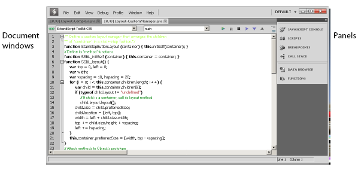
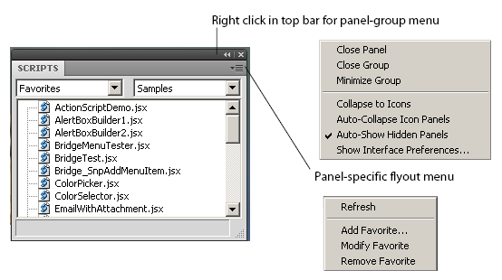

# Configuring the Toolkit window

The ExtendScript Toolkit initially appears with a default workspace arrangement, containing a default configuration of tabbed panels and Script Editor document windows contained in a parent frame. The arrangement is highly configurable, through the Window menu, the context menus of individual panels and panel groups, or directly using drag and drop.

You can, for example, adjust the relative sizes of the panels by dragging the separators up or down, or right or left, and can rearrange the groupings. To move a tabbed panel, drag the tab into another pane.

If you drag a tab so that the entire destination group is highlighted, it becomes another stacked panel in that group. If you drag a tab to the top or bottom of a group (so that only the top or bottom bar of the destination group is highlighted), that group splits to show the panels in a tiled format.

- You can dock the entire panel group to different edges of the Toolkit window.
- You can collapse the entire panel group, then expose individual panels.
- You can open and close, or collapse and expand individual panels, regardless of the dock state.
- You can undock individual tabs or the entire control panel, making them floating panels. Floating panels can be docked to each other, or can be independent.

There are predefined configurations, called workspaces, suitable for various uses, and you can save your favorite configurations as workspaces. See [Workspaces](#workspaces).

---

## Panel menus

Panel groups have a context menu, which you invoke with a right click in the tab or on the background of the title bar. These menus have panel-control commands, including Close Panel and Close Group to hide the individual panel or entire group.

- You can also show or hide specific panels by toggling them on or off in the Window menu. Use the Window menu to show a hidden panel, or to bring a floating panel to the front.
- Use Window > Hide panels to close all of the panels.

Some panels also have a flyout menu, specific to that panel, which you access through the menu icon in the upper right corner. The JavaScript Console has a right-click menu that allows you to copy and paste text.

The individual panels are discussed in detail in the following sections.

---

## Document windows

When you open scripts or text files, each file appears in its own Script Editor document window. By default, the document windows are docked; that is, shown as tabbed panes in the main window. However, like the panels, you can drag any document window out of the frame to make it an independent floating window.

If you are displaying more than one document, and you have undocked one or more of them, you can choose to show the document windows in tiled or cascade style-that is, side by side in the main window, or overlapping in the main window. To do this, choose Window > Tile Documents or Window > Cascade.

You can edit or run scripts in multiple document windows simultaneously. The current document window is highlighted and has the input focus. You can select another document window by clicking in it, or you can switch between them with the commands Window > Next document and Window > Previous document. The default keyboard shortcuts for these commands are F6 and SHIFT-F6; you can change these using the Keyboard Shortcuts page in the Preferences dialog (Edit > Preferences).

:::note

For example, if one script opens a modal dialog in Photoshop, and you run another script that targets Photoshop while the dialog is still open, the second script is likely to generate an error.
:::

*A button in the upper right corner of the document window allows you to split that window.*

When the window is split, the second window is another view of exactly the same source. Any changes you make in the text, breakpoints that you add, and so on, appear simultaneously in both windows. The copy is, by default, positioned to the right of the original, docked window, as shown. However, if you use CTRL-click to split the window, the second appears below the original.

For more information about the document windows and the Script Editor, see [The Script Editor](../the-script-editor).

---

## Workspaces

The Toolkit saves the current layout when you exit, and restores it at the next startup. It saves and restores the open documents, the current positions within the documents, any breakpoints that have been set, and other preferences that have been set in the Preferences dialog.

- The Startup page in the Preferences dialog (Edit > Preferences) offers a choice of whether to open a blank document window, no document window, or display a previously opened document on startup.
- The Tookit defines a number of workspace configurations that are suitable for specific usage types. To choose a predefined or user-defined workspace, use the workspace menu that drops down from the upper right corner of the Toolkit.
    - When you choose a workspace, its name appears here. You can also add and remove workspaces from this menu.
    
- You can save any configuration as a named workspace, using the Create new Workspace menu command, or the Add button on the Workspaces page in the Preferences dialog (Edit > Preferences).
- You can remove workspaces you have defined, either individually using the menu or the Workspaces page in the Preferences dialog, or all at once using the Default button at the bottom of the Workspace page.
- The Keyboard Shortcuts page in the Preferences dialog (Edit > Preferences) allows you to set or modify keyboard shortcuts for all menu commands. There is a warning if you assign a key combination that is already in use. If you assign the combination to a new command, it is removed from the previous command.
- You can restore all preferences to their default values by holding the SHIFT key down while the Toolkit loads.

---

## Dialogs

Some dialog windows offer the option "Don't show again". If you select this option, the Toolkit remembers the choices made in this dialog, and next time it would appear, makes the same choices without showing the dialog.

To make these dialogs display again, click Reset Dialogs on the User Interface page in the Preferences dialog (Edit > Preferences).
