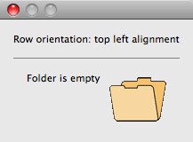
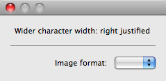
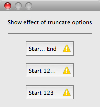

# Managing control titles

User interface elements often need a title or label to identify their purpose, with the title placed near the element it identifies. As shown by examples in [Automatic layout](../automatic-layout), you can use a `statictext` element as a title or label, and use the automatic layout mechanism to control the placement of such a title relative to the element it identifies.

The title-layout mechanism provides a simpler way to accomplish this task for many common cases. It allows you to define an element's title and its spacial relationship with the graphic representation of the object it identifies, without the need for additional `statictext` and container elements. Title layout operates on an element's optional [title](../control-objects#title) and [titleLayout](../control-objects#titlelayout) properties.

It treats this title and the element's graphic representation as two separate objects whose relative positions are controlled according to layout rules within a virtual container that encloses both objects. This is similar to the operation of the automatic layout mechanism, but within a more limited scope.

Title layout is available for these types of UI elements:

- [DropDownList](../control-objects#dropdownlist)
- [FlashPlayer](../control-objects#flashplayer)
- [IconButton](../types-of-controls#iconbutton)
- [Image](../types-of-controls#image)
- [TabbedPanel](../control-objects#tabbedpanel)

For most of these element types, the title typically appears outside the element itself, and the virtual container is an imaginary line surrounding the title and the separate element. For the IconButton, the title appears inside the bounds of the button, and the virtual container is defined by the outer bounds of the element. The same principles apply in both cases.

- The [title](../control-objects#title) property is a String that defines a text label for a UI element. The title can appear to the left or right of the graphic element, above or below it, or superimposed over the center of the graphic element; the placement is controlled by the [titleLayout](../control-objects#titlelayout) property.
- The [titleLayout](../control-objects#titlelayout) property is an Object containing properties that specify:
    - The title's character width;
    - The title's justification within the character width;
    - How the title should be truncated if necessary;
    - The orientation, alignment, and spacing of the title with respect to the object it identifies;
    - The margins within the virtual container that surrounds the title and its related object.

All `titleLayout` properties are optional; the element types that use this mechanism have default values for each property. Complete details are provided in the reference section; see [titleLayout](../control-objects#titlelayout).

The following sections provide examples that show how to use title layout to achieve many different layouts.

---

## Title alignment and orientation

Unlike automatic layout, title layout uses the [alignment](../control-objects#alignment) property to specify the orientation of the title and graphic element, and how the title aligns to the graphic element. This property contains a 2-element array, where the first element specifies horizontal alignment and the second specifies vertical alignment. The allowed values for these are the same as those used by automatic layout (see [Aligning children](../automatic-layout#aligning-children)), except that the `fill` value is not allowed.

- To achieve a row orientation where the title appears to the left or right of the graphic element, define horizontal alignment as left or right and vertical alignment as `center`, `top`, or `bottom`:
    ```javascript
    button.titleLayout = { alignment: ["right", "center"] };
    ```

    
- To achieve a column orientation where the title appears above or below the graphic element, define vertical alignment as `top` or `bottom`, and horizontal alignment as `center`:
    ```javascript
    image.titleLayout = { alignment: ["center", "bottom"] };
    ```

    
- To achieve a stack orientation where the title appears superimposed upon the graphic element, define both vertical and horizontal alignment as `center`. This orientation is mainly useful with the `iconbutton` or `image` element types; it does not make sense to superimpose a title over a dropdownlist, for instance. In this example, the button"s title is centered over its iconic image:
    ```javascript
    button.title = "Get information";
    button.titleLayout = { alignment: ["center", "center"] };
    ```

    
- With row orientation, you can control whether the title aligns to the top, center, or bottom of the graphic element. In this example, the title is placed to the left of the image, aligned at the top edge:
    ```javascript
    image.titleLayout = { alignment: ["left", "top"] };
    ```

    
- Use `spacing` to override the default number of pixels separating the title from the graphic element. In this example, titleLayout is configured to place the title 15 pixels above the panel:
    ```javascript
    panel.title = "Image format";
    panel.titleLayout = { alignment: ["center", "top"], spacing: 15 };
    ```

    

---

## Title character width and justification

- To override the automatically calculated title width, define a positive non-zero value for the `characters` property. This reserves enough space in the title area to hold the specified number of "X" characters. This is useful when an element's title can change (for localized values, for instance) and you want to reserve enough space to fit all the expected values without truncation or affecting the overall layout.
    ```javascript
    droplist.titleLayout = { alignment: ["left", "center"], characters: 20 };
    ```

    
- When a `characters` value specifies a width greater than the default title width, you can set the `justify` property to control how the text of the title is justified within the space reserved for it. The value `left` places the text at the left end of the space, leaving blank space on the right; `right` places the text at the right end of the space, leaving blank space on the left; and `center` places the text in the middle of the space, dividing any blank space evenly on both sides of the text.
    ```javascript
    droplist.titleLayout = { alignment: ["left", "center"],
                             characters: 20,
                             justify: "right" };
    ```

    
- This example demonstrates using `characters` and `justify` to vertically align the colons at the ends of all the dropdownlist control titles in a group. The same `characters` value is used for each element"s `title`, and all are right-justified:
    ```javascript
    w.ddl1 = w.add("dropdownlist { title: "Image format:" }");
    w.ddl2 = w.add("dropdownlist { title: "Background color:" }");
    w.ddl3 = w.add("dropdownlist { title: "Text color:" }");
    w.ddl1.titleLayout = { alignment: ["left", "center"], spacing: 3,
                           characters: 16, justify: "right" };
    w.ddl2.titleLayout = { alignment: ["left", "center"], spacing: 3,
                           characters: 16, justify: "right" };
    w.ddl3.titleLayout = { alignment: ["left", "center"], spacing: 3,
                           characters: 16, justify: "right" };
    ```

    

---

## Title truncation

If the space reserved for a title is not wide enough to display its entire text, set the `truncate` property to control the appearance of the truncated text. If `truncate` is `middle`, characters are removed from the middle of the text and replaced with an ellipsis (...). For the value `end`, characters are removed from the end of the text and replaced with an ellipsis. If `truncate` is `none` or is not defined, characters are removed from the end, without any replacement ellipsis character.

This example demonstrates the effect of all three options on the same title string:

```javascript
w.btn1 = w.add("iconbutton { title: 'Start 123456 End', image: 'SystemWarningIcon' }");
w.btn2 = w.add("iconbutton { title: 'Start 123456 End', image: 'SystemWarningIcon' }");
w.btn3 = w.add("iconbutton { title: 'Start 123456 End', image: 'SystemWarningIcon' }");
w.btn1.titleLayout = { characters: 8, truncate: 'middle' };
w.btn2.titleLayout = { characters: 8, truncate: 'end' };
w.btn3.titleLayout = { characters: 8, truncate: 'none' };
```



---

## Margins around the title and graphic object

The `margins` property specifies the number of pixels separating each edge of an element from the visible content within that element. This value overrides the default margin settings (no margins for most element types, 6 pixels at each edge for `iconbutton`).

- For `iconbutton`, the margins value controls the padding between the button's frame and its title and icon image.
- For other element types, `margins` controls the padding between the imaginary border surrounding the union of the bounding boxes of the title and graphic object, which makes the space occupied by an element larger than its default measurements.

This example demonstrates overriding the default margins for `iconbutton` and `dropdownlist` elements.

The lists are enclosed in panels to create artificial borders around them:

```javascript
w.btn1 = w.add("iconbutton { title: 'Default margins', image: 'SystemWarningIcon' }");

w.btn2 = w.add("iconbutton { title: 'Extra T/B margins', image: 'SystemWarningIcon' }");
var defaultBtnMargins = w.btn2.titleLayout.margins;
w.btn2.titleLayout = { margins: [defaultBtnMargins[0], 15, defaultBtnMargins[2], 15] };

w.panel1 = w.add("panel { margins: 0, ddl1: DropDownList { title: 'Default margins' } }");
w.panel2 = w.add("panel { margins: 0, ddl2: DropDownList { title: 'Extra L/R margins' } }");
w.panel2.ddl2.titleLayout = { margins: [15, 0, 15, 0] };
```


