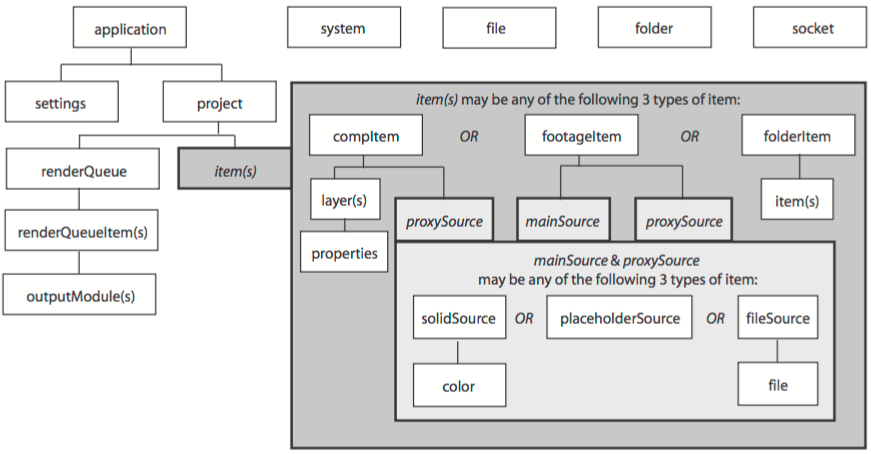
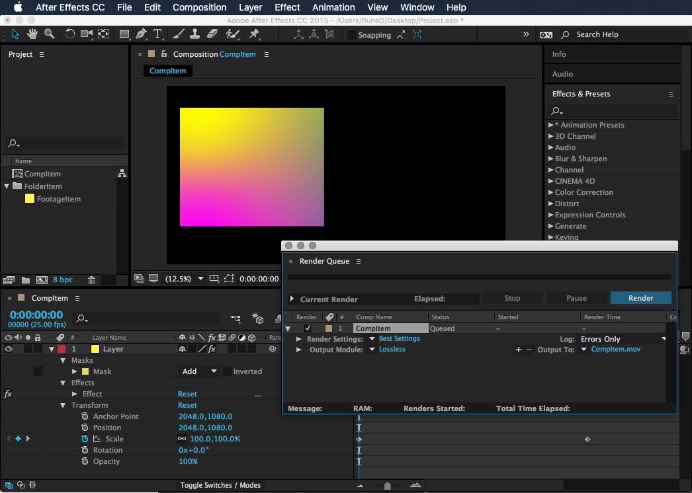

# After Effects 对象模型

当您浏览按对象字母顺序组织的参考部分时，可以参考以下图表，了解各种对象在层次结构中的位置及其与用户界面的对应关系。

*After Effects 主要脚本对象的层次结构图*

请注意，[Extendscript 文件](https://extendscript.docsforadobe.dev/file-system-access/file-object.html)、文件夹和套接字对象由 ExtendScript 定义，并在 [JavaScript 工具指南](https://extendscript.docsforadobe.dev/) 中进行了文档说明。

ExtendScript 还定义了 ScriptUI 模块，这是一组窗口和用户界面控件对象，可供 After Effects 脚本使用。这些内容也在 [JavaScript 工具指南](https://extendscript.docsforadobe.dev/) 中进行了文档说明。

脚本中的对象层次结构与用户界面中的层次结构相对应。

应用程序包含一个项目面板，用于显示项目。项目包含合成，合成包含图层。图层的源可以是素材文件、占位符或纯色，这些也会列在项目面板中。每个图层包含称为属性的设置，这些属性可以包含标记和关键帧。渲染队列包含渲染队列项以及渲染设置和输出模块。所有这些实体在脚本中都有对应的对象表示。

:::note
为避免歧义，本手册使用术语“属性”来指代 JavaScript 对象属性，并使用术语“属性”或“AE 属性”来指代 After Effects 图层属性。
:::

#### 对象摘要

下表按字母顺序列出了所有对象，并附有每个对象的文档页面链接。

|              对象               |         描述         |
| ----------- | ---------------------- |
| [全局函数](../../general/globals)           | 全局可用的函数，允许您显示文本以用于脚本调试，并帮助在秒和帧之间转换时间值。 |
| [应用程序对象](../../general/application)         | 一个全局对象，通过其名称（app）访问，提供对 After Effects 应用程序中的对象和应用程序设置的访问。 |
| [AVItem 对象](../../item/avitem)              | 表示导入 After Effects 的音频/视频文件。                    |
| [AVLayer 对象](../../layer/avlayer)             | 表示包含 AVItem 对象的图层（合成图层、素材图层、纯色图层、文本图层和声音图层）。        |
| [CameraLayer 对象](../../layer/cameralayer)         | 表示合成中的摄像机图层。            |
| [Collection 对象](../../other/collection)           | 将一组对象或值关联为一个逻辑组，并通过索引提供对它们的访问。               |
| [CompItem 对象](../../item/compitem)            | 表示一个合成，并允许您操作它并获取有关它的信息。                  |
| [FileSource 对象](../../sources/filesource)         | 描述来自文件的素材。                |
| [FolderItem 对象](../../item/folderitem)          | 表示项目面板中的文件夹。                |
| [FootageItem 对象](../../item/footageitem)          | 表示导入项目中的素材项，这些素材项会出现在项目面板中。      |
| [FootageSource 对象](../../sources/footagesource)       | 描述某些素材的文件源。               |
| [ImportOptions 对象](../../other/importoptions)       | 封装了将文件导入 After Effects 的选项。                  |
| [Item 对象](../../item/item)   | 表示项目中出现在项目面板中的项。                |
| [ItemCollection 对象](../../item/itemcollection)      | 收集项目中的项。                     |
| [KeyframeEase 对象](../../other/keyframeease)         | 封装 After Effects 属性中的关键帧缓动值。                 |
| [Layer 对象](../../layer/layer)               | 图层类的基类。                    |
| [LayerCollection 对象](../../layer/layercollection)     | 收集项目中的图层。                      |
| [LightLayer 对象](../../layer/lightlayer)           | 表示合成中的灯光图层。             |
| [MarkerValue 对象](../../other/markervalue)         | 封装 After Effects 属性中的标记值。                    |
| [MaskPropertyGroup 对象](../../property/maskpropertygroup)  | 封装图层中的遮罩属性。               |
| [OMCollection 对象](../../renderqueue/omcollection)     | 收集渲染队列中的输出模块。               |
| [OutputModule 对象](../../renderqueue/outputmodule)     | 表示渲染队列的输出模块。            |
| [PlaceholderSource 对象](../../sources/placeholdersource)   | 描述素材的占位符。                 |
| [Project 对象](../../general/project)             | 表示 After Effects 项目。                 |
| [Property 对象](../../property/property)          | 表示 After Effects 属性。                  |
| [PropertyBase 对象](../../property/propertybase)      | After Effects 属性和属性组类的基类。               |
| [PropertyGroup 对象](../../property/propertygroup)      | 表示 After Effects 属性组。              |
| [RenderQueue 对象](../../renderqueue/renderqueue)       | 表示 After Effects 渲染队列。               |
| [RenderQueueItem 对象](../../renderqueue/renderqueueitem)   | 表示渲染队列中的可渲染项。            |
| [RenderQueueItem 对象](../../renderqueue/renderqueueitem)   | 收集渲染队列中的渲染队列项。             |
| [RQItemCollection 对象](../../renderqueue/rqitemcollection) | 提供对应用程序设置和首选项的访问。                    |
| [Shape 对象](../../other/shape)               | 封装遮罩的轮廓形状信息。         |
| [ShapeLayer 对象](../../layer/shapelayer)           | 表示合成中的形状图层。             |
| [SolidSource 对象](../../sources/solidsource)         | 描述作为某些素材源的纯色。                   |
| [System 对象](../../general/system)             | 提供从应用程序访问操作系统的功能。                   |
| [TextDocument 对象](../../text/textdocument)        | 封装文本图层中的文本。                 |
| [TextLayer 对象](../../layer/textlayer)           | 表示合成中的文本图层。              |
| [Viewer 对象](../../other/viewer)               | 表示合成、图层或素材面板。           |