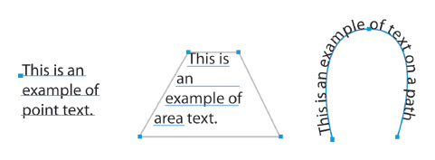
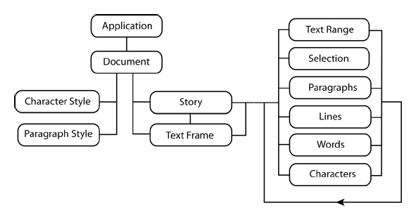

# 文本对象

当你在 Illustrator 文档中输入内容时，文本会自动变成一个 `文本框架` 对象，同时也是一个故事对象。

要观察这一点，请在 Illustrator 中打开一个新文档，使用水平文本工具输入一些文本，然后使用垂直文本工具输入更多文本。

最后，创建一个矩形并在其中输入一些文本。

现在运行以下 JavaScript 脚本

```javascript
var myDoc = app.activeDocument;
alert("There are " + myDoc.textFrames.length + " text frames.");
alert("There are " + myDoc.stories.length + " stories.");
```

---

## 文本框架

文本框架有三种类型：

- 点文本
- 区域文本
- 路径文本



要创建特定类型的文本框架，请在 AppleScript 中使用 `文本框架` 对象的 `kind` 属性。

JavaScript 和 VBScript 的 `文本框架` 对象包含用于创建区域文本框架和路径文本框架的特定方法。

与 Illustrator 应用程序一样，你可以链接区域或路径文本框架。

要链接现有的文本框架，请使用 `文本框架` 对象的 `next frame` 或 `previous frame` 属性。

链接的框架构成一个单一的 `故事` 对象。

有关创建或链接文本框架的信息，请参阅本手册中与你的脚本语言相关的章节。

### 文本几何

虽然三种文本框架具有共同的特性，例如 `orientation`，但每种类型都有其特定的属性，这反映在 `文本框架` 对象的属性中。例如：

- 区域文本框架可以有行和列，你可以通过 `row count` 和 `column count` 属性访问它们。
- 路径文本具有 `start T` 值和 `end T` 值属性，用于指示文本在路径上的开始和结束位置。
- 区域和路径文本框架与文本路径对象相关联，该对象使用 `文本框架` 对象的 `text path` 属性指定。文本路径定义了文本框架在画板上的位置和方向（水平或垂直）（而 `文本框架` 对象的 `orientation` 属性定义了文本框架内文本的方向）。`text path` 属性对点文本无效，因为点文本的位置和方向完全由文本框架本身的属性定义。

:::note
文本路径与路径艺术项不同。文本路径与路径艺术项相关联，可以访问和操作这些路径艺术项以修改关联文本框架的外观。
:::

---

## 表示文本内容的对象

在文本框架或故事中，实际的文本内容可以作为以下任何对象访问：

- `字符`
- `单词`
- `段落`
- `行`

`行` 对象是 `文本框架` 或 `故事` 对象中适合一行的所有字符。

所有文本艺术项至少有一行文本，定义为 `行` 对象。

如果文本包含硬换行符或其字符因为不适合文本艺术的宽度而流到新行，则文本艺术可以有多行文本。

文本对象通过 `文本框架` 和 `故事` 对象中的集合访问和标识；例如

```javascript
textFrame("My Text Frame").paragraphs
// 或
story("My Story").paragraphs
```



`文本框架` 和 `故事` 对象都有 `插入点` 和 `文本选择` 属性。

`文本框架` 对象的属性还包括文本框架的定义特征，例如：

- 框架的 `宽度`、`高度` 和 `位置`
- 框架是否 `隐藏` 或 `锁定`
- 文本是否 `可编辑`

:::note
`行` 对象不能在脚本中创建。你的脚本可以创建 `字符`、`段落` 和 `单词` 对象。
:::

### 文本范围

文本框架或故事中的各种文本对象也由 `文本范围` 对象集体表示。

例如，一个字符是一个长度为 1 的文本范围，而一个单词是一个前面有空格的文本范围。

你可以通过使用 `contents` 属性传递字符串来设置文本范围对象的内容。

---

## 文本样式

文本样式元素，如 `字体`、`大写` 和 `对齐`，由 `段落属性` 和 `字符属性` 对象表示。

这些属性对象是 `段落样式` 和 `字符样式` 对象的属性。

`段落样式` 和 `字符样式` 对象具有 `apply to` 和 `remove` 方法，允许你的脚本在特定段落、字符或文本范围内分配或删除属性。

你可以通过应用适当的样式或在文本或段落级别提供属性的本地覆盖来更改文本范围的显示属性：

- 字符样式对象适用于一个或多个字符的集合。它们控制字符特性，如 `字体`、`对齐`、`行距`、`语言` 和 `大写`，这些是 `字符属性` 对象的属性。
- `段落样式` 对象适用于段落。它们控制段落特性，如 `首行缩进`、`左缩进` 和 `右缩进`，这些是 `段落属性` 对象的属性。
```