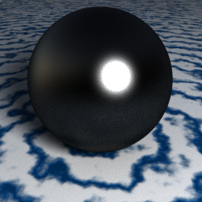

| 上下文 | [着色](../contexts/shading.html) |
| --- | --- |



`bsdf  phong(float exponent, ...)`

`bsdf  phong(vector nml, float exponent, ...)`

关于BSDF的更多信息，请参阅[编写PBR着色器](../pbr.html)。

`vector  phong(vector nml, vector V, float shinyness, ...)`

V代表从表面指向眼睛的归一化向量(-normalize(I))。shinyness是Phong指数（通常在20或更高）。roughness表示表面粗糙度（通常在0到1之间）。

光源包含/排除选项

## 光源包含排除选项

"`categories`",
`string`
`="*"`

通过光源的"类别"标签指定要包含/排除的光源。
这是首选的包含/排除光源方式，而不是使用`"lightmask"`关键字参数通过模式匹配光源名称。

例如：

```vex
diff = diffuse(nml, "lightmask", "hero | fill");

```

更多信息请参阅[光源类别](../../render/lights.html#categories)。

"`lightmask`",
`string`
`="*"`

在评估光照和阴影着色器时，对象有预定义的光照遮罩。这个遮罩通常在几何体对象中指定，
列出了用于照亮表面或雾着色器的光源列表。可以通过指定"lightmask"参数来覆盖默认的光照遮罩。

例如：

```vex
diff = diffuse(nml, "lightmask", "light*,^light2");

```

...这将使所有名称以"light"开头（除了名为"light2"的光源）的光源被考虑用于漫反射照明。

支持所有Houdini作用域模式（组扩展除外）：

- `*` - 通配符匹配
- `?` - 单字符匹配
- `^` - 排除操作符
- `[list]` - 字符列表匹配
