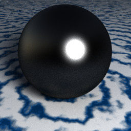

`bsdf  phonglobe(vector dir, float exponent, ...)`

`bsdf  phonglobe(vector nml, vector dir, float exponent, ...)`

`bsdf  phonglobe(vector dir, float exponentx, float exponenty, vector framex, vector framey, ...)`

`bsdf  phonglobe(vector nml, vector dir, float exponentx, float exponenty, vector framex, vector framey, ...)`

沿着给定方向向量的Phong（模糊）反射。当方向向量是反射向量时，这将产生与`phong()`相同的结果，但使用此函数您还可以从其他方向（如透射）收集光照。

通过提供x和y指数及切线向量，可以创建各向异性的Phong波瓣。

`dir`

高光方向。

`nml`

可选的法线，用于指定反射方向的半球。

`exponent`

Phong指数。

`exponentx`

沿`framex`向量的Phong指数。

`exponenty`

沿`framey`向量的Phong指数。

`framex`

高光X方向

`framey`

高光Y方向