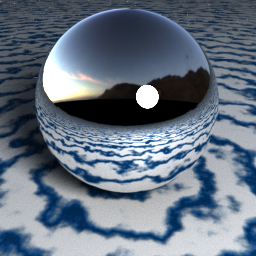

`bsdf  specular(vector dir, ...)`

返回一个高光BSDF，其中dir是高光方向。
关于BSDF的更多信息，请参阅[编写PBR着色器](../pbr.html)。

`vector  specular(vector nml, vector V, float roughness, ...)`

计算高光着色。

光源包含/排除选项

## 光源包含排除选项

"`categories`",
`string`
`="*"`

通过光源的"category"标签指定要包含/排除的光源。
这是比使用`"lightmask"`关键字参数通过模式匹配光源名称更推荐的包含/排除光源方式。

例如：

```vex
diff = diffuse(nml, "lightmask", "hero | fill");

```

更多信息请参阅[光源分类](../../render/lights.html#categories)。

"`lightmask`",
`string`
`="*"`

在评估光源和阴影着色器时，对象有预定义的光源遮罩。
这个遮罩通常在几何对象中指定，定义了用于照亮表面或雾着色器的光源列表。
可以通过指定"lightmask"参数来覆盖默认的光源遮罩。

例如：

```vex
diff = diffuse(nml, "lightmask", "light*,^light2");

```

...这将使所有名称以"light"开头（除了名为"light2"的光源）的光源被考虑用于漫反射照明。

支持所有Houdini作用域模式（组扩展除外）：

- `*` - 通配符匹配
- `?` - 单字符匹配
- `^` - 排除运算符
- `[list]` - 字符列表匹配
