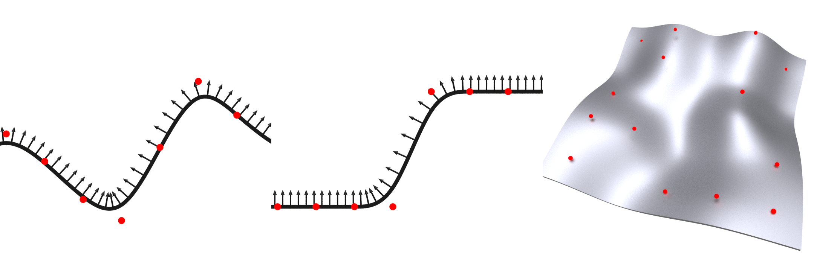

`float  volumesmoothsample(<geometry>geometry, int primnum, vector pos)`

`float  volumesmoothsample(<geometry>geometry, string volumename, vector pos)`

`float  volumesmoothsample(<geometry>geometry, int primnum, vector pos, vector &grad)`

`float  volumesmoothsample(<geometry>geometry, string volumename, vector pos, vector &grad)`

`float  volumesmoothsample(<geometry>geometry, int primnum, vector pos, vector &grad, matrix3 &hess)`

`float  volumesmoothsample(<geometry>geometry, string volumename, vector pos, vector &grad, matrix3 &hess)`

`<geometry>`

在节点上下文（如wrangle SOP）中运行时，此参数可以是一个表示输入编号（从0开始）的整数，用于读取几何体。

或者，该参数可以是指定要读取的几何文件（例如`.bgeo`）的字符串。在Houdini内部运行时，可以是`op:/path/to/sop`引用。

返回值

在给定位置处体积图元的采样值。体素之间的值通过平滑插值计算。

`grad`和`hess`参数可同时返回此采样函数的梯度或Hessian矩阵。

如果`primnum`或`inputnum`超出范围、几何体无效，或给定图元不是体积或VDB图元，则返回0。


使用`volumesmoothsample`对一维和二维数据进行插值的示例。可视化法线是使用`grad`参数计算的。

## 示例

使用点`P`处的体积值近似计算点`P + u`处的体积值。

```vex
vector  P = {1.0, 2.0, 3.0};
vector grad;
matrix3 hess;
float val1 = volumesmoothsample(0, "density", P, grad, hess);

vector u = {0.1, 0.01, 0.001};
float val2 = volumesmoothsample(0, "density", P + u);

// 根据泰勒展开式我们有：
// `val1 + dot(u, grad)` 约等于 `val2`

// 二阶近似：
// `val1 + (u, grad) + 0.5 * dot(u, u*hess)`
// 约等于 `val2`

```
