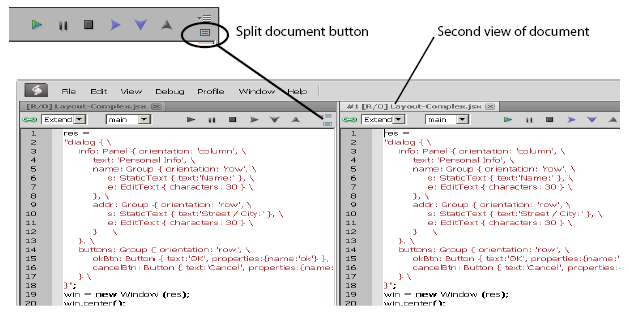
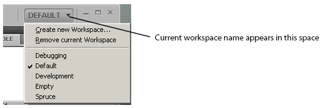

# 配置工具窗口

ExtendScript Toolkit 初始显示时带有默认的工作区布局，包含默认配置的选项卡面板和包含在父框架中的脚本编辑器文档窗口。通过窗口菜单、各个面板和面板组的上下文菜单，或直接使用拖放操作，可以高度自定义布局。

例如，您可以通过上下或左右拖动分隔符来调整面板的相对大小，并可以重新排列分组。要移动选项卡面板，请将选项卡拖到另一个窗格中。

如果您拖动选项卡以使整个目标组高亮显示，它将成为该组中的另一个堆叠面板。如果您将选项卡拖动到组的顶部或底部（以便仅目标组的顶部或底部栏高亮显示），则该组会拆分以平铺格式显示面板。

- 您可以将整个面板组停靠在工具窗口的不同边缘。
- 您可以折叠整个面板组，然后展开单个面板。
- 无论停靠状态如何，您都可以打开或关闭、折叠或展开单个面板。
- 您可以取消停靠单个选项卡或整个控制面板，使其成为浮动面板。浮动面板可以相互停靠，也可以独立存在。

有一些预定义的配置，称为工作区，适用于各种用途，您可以将您喜欢的配置保存为工作区。请参阅[工作区](#workspaces)。

---

## 面板菜单

面板组有一个上下文菜单，您可以通过右键单击选项卡或标题栏的背景来调用。这些菜单包含面板控制命令，包括“关闭面板”和“关闭组”以隐藏单个面板或整个组。

- 您还可以通过在窗口菜单中切换来显示或隐藏特定面板。使用窗口菜单显示隐藏的面板，或将浮动面板置于前面。
- 使用窗口 > 隐藏面板以关闭所有面板。

某些面板还有一个特定于该面板的弹出菜单，您可以通过右上角的菜单图标访问。JavaScript 控制台有一个右键菜单，允许您复制和粘贴文本。

各个面板将在以下部分中详细讨论。

---

## 文档窗口

当您打开脚本或文本文件时，每个文件都会显示在其自己的脚本编辑器文档窗口中。默认情况下，文档窗口是停靠的；也就是说，作为主窗口中的选项卡窗格显示。然而，与面板一样，您可以将任何文档窗口拖出框架，使其成为独立的浮动窗口。

如果您显示多个文档，并且您已经取消停靠其中一个或多个文档，您可以选择以平铺或层叠样式显示文档窗口——即并排显示在主窗口中，或重叠显示在主窗口中。为此，请选择窗口 > 平铺文档或窗口 > 层叠。

您可以同时在多个文档窗口中编辑或运行脚本。当前文档窗口高亮显示并具有输入焦点。您可以通过单击选择另一个文档窗口，或者您可以使用命令窗口 > 下一个文档和窗口 > 上一个文档在它们之间切换。这些命令的默认键盘快捷键是 F6 和 SHIFT-F6；您可以使用首选项对话框中的键盘快捷键页面（编辑 > 首选项）更改这些快捷键。

:::note

例如，如果一个脚本在 Photoshop 中打开了一个模态对话框，而您在对话框仍然打开时运行另一个针对 Photoshop 的脚本，第二个脚本可能会生成错误。
:::

*文档窗口右上角的一个按钮允许您拆分该窗口。*

当窗口被拆分时，第二个窗口是同一源的另一个视图。您在文本中所做的任何更改、添加的断点等都会同时出现在两个窗口中。默认情况下，副本位于原始停靠窗口的右侧，如图所示。但是，如果您使用 CTRL-单击拆分窗口，第二个窗口将出现在原始窗口的下方。

有关文档窗口和脚本编辑器的更多信息，请参阅[脚本编辑器](../the-script-editor)。

---

## 工作区

工具包在退出时保存当前布局，并在下次启动时恢复。它保存并恢复打开的文档、文档中的当前位置、设置的任何断点以及在首选项对话框中设置的其他首选项。

- 首选项对话框中的启动页面（编辑 > 首选项）提供了一个选择，即在启动时是打开空白文档窗口、无文档窗口，还是显示先前打开的文档。
- 工具包定义了许多适用于特定使用类型的工作区配置。要选择预定义或用户定义的工作区，请使用从工具包右上角下拉的工作区菜单。
    - 当您选择一个工作区时，其名称会显示在此处。您还可以从此菜单中添加和删除工作区。
    
- 您可以使用“创建新工作区”菜单命令或首选项对话框中的工作区页面上的添加按钮（编辑 > 首选项）将任何配置保存为命名工作区。
- 您可以删除您定义的工作区，可以单独使用菜单或首选项对话框中的工作区页面，也可以使用工作区页面底部的默认按钮一次性删除所有工作区。
- 首选项对话框中的键盘快捷键页面（编辑 > 首选项）允许您为所有菜单命令设置或修改键盘快捷键。如果您分配了一个已经在使用的键组合，会有一个警告。如果您将该组合分配给新命令，它将从先前的命令中删除。
- 您可以通过在工具包加载时按住 SHIFT 键来将所有首选项恢复为默认值。

---

## 对话框

某些对话框窗口提供“不再显示”选项。如果您选择此选项，工具包会记住在此对话框中所做的选择，并在下次出现时做出相同的选择而不显示对话框。

要使这些对话框再次显示，请单击首选项对话框中的用户界面页面上的重置对话框（编辑 > 首选项）。