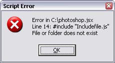
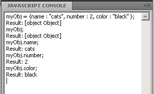
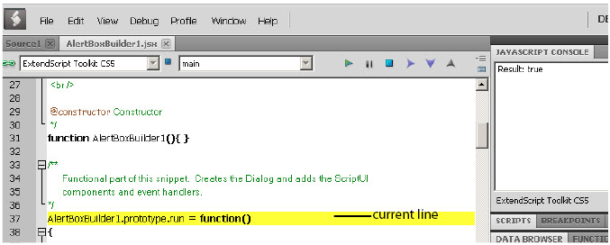
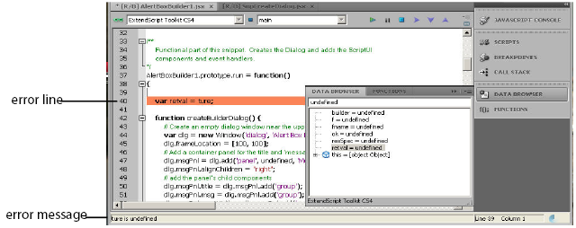
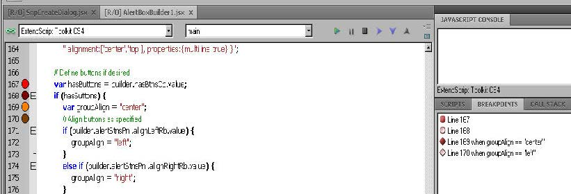
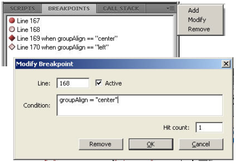
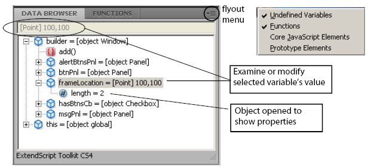
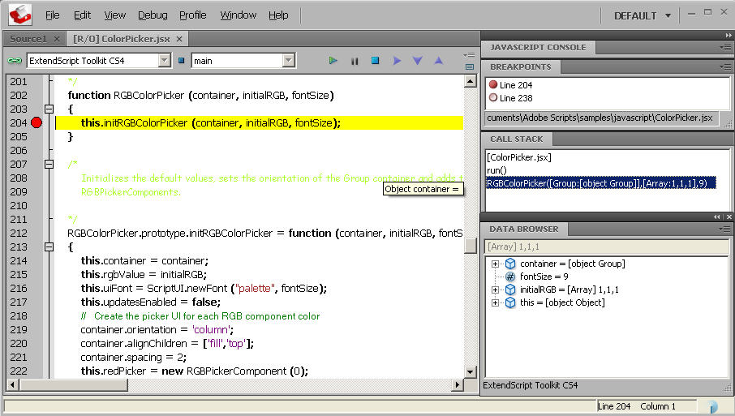
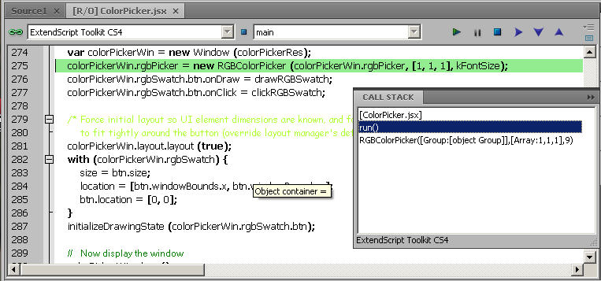

# 工具包中的调试

您可以在当前活动的文档窗口中调试代码。选择一个调试命令来运行或单步执行程序。

当您从文档窗口运行代码时，它会在当前目标应用程序的选定 JavaScript 引擎中运行。工具包本身运行一个独立的 JavaScript 引擎，因此您可以快速编辑和运行脚本，而无需连接到目标应用程序。

---

## 选择调试目标

工具包可以同时调试多个应用程序。如果您安装了多个 Adobe 应用程序，请使用文档窗口左上角的下拉列表选择该窗口的目标应用程序。所有支持 JavaScript 的已安装应用程序都会显示在此列表中。如果您尝试在未运行的应用程序中运行脚本，工具包会提示您是否允许运行它。

某些应用程序使用多个 JavaScript 引擎；所选目标应用程序中所有可用的引擎都会显示在应用程序列表右侧的下拉列表中，并带有一个图标，显示该引擎的当前调试状态。一个目标应用程序可以有多个 JavaScript 引擎，并且可以有多个引擎处于活动状态，尽管只有一个引擎是当前的。活动引擎是当前正在执行代码、在断点处暂停或已执行所有脚本并等待接收事件的引擎。

每个引擎名称旁边的图标指示其状态是运行中、暂停还是等待输入：

| 图标 | 状态 |
| --- | --- |
|  | 运行中 |
|  | 暂停 |
|  | 等待 |

当前引擎是其数据和状态显示在工具包窗格中的引擎。如果应用程序只有一个引擎，当您选择该应用程序作为目标时，其引擎将成为当前引擎。如果目标应用程序中有多个引擎可用，您可以在列表中选择一个引擎使其成为当前引擎。

当您打开工具包时，工具包本身是默认的目标应用程序。当您选择另一个目标时，如果您选择的目标应用程序未运行，工具包会提示您是否允许并启动该应用程序。同样，如果您运行一个指定未运行的目标应用程序的脚本（使用 #target 指令），工具包会提示您是否允许启动它。如果应用程序正在运行但未选择为当前目标，工具包会提示您切换到它。

如果您选择了一个无法在工具包中调试的应用程序，错误对话框会报告工具包无法连接到所选应用程序。

ExtendScript 工具包是 JSX 文件的默认编辑器。如果您在文件浏览器中双击 JSX 文件，工具包会查找文件中的 #target 指令并启动该应用程序以运行脚本；但是，它首先会检查脚本中的语法错误。

如果发现任何错误，工具包会在消息框中显示错误并静默退出，而不是启动目标应用程序。例如：

---

## JavaScript 控制台

JavaScript 控制台是当前选定的 JavaScript 引擎的命令外壳和输出窗口。它将您连接到该引擎的全局命名空间。

控制台是一个 JavaScript 监听器，期望输入文本是 JavaScript 代码。

您可以使用控制台来评估表达式或调用函数。输入任何 JavaScript 语句并按 ENTER 执行它。该语句在调用堆栈面板中突出显示的行的堆栈范围内执行，结果出现在下一行。

- 您可以使用上下箭头键滚动浏览之前的条目，或用鼠标放置光标。按 ENTER 执行包含光标的行或所有选定的行。
- 右键单击上下文菜单提供与文档窗口相同的编辑命令。
- 您可以复制、剪切和粘贴文本，并撤消和重做之前的操作。
- 您可以用鼠标选择文本，并使用正常的复制和粘贴快捷键。
- 弹出菜单允许您清除当前内容。
- 在控制台中输入的命令执行超时时间为 1 秒。如果命令执行时间超过 1 秒，工具包会生成超时错误并终止尝试。
- 控制台是 JavaScript 执行的标准输出位置。如果任何脚本生成语法错误，错误会在此处显示，并附带文件名和行号。工具包在其启动阶段也会在此处显示错误。

---

## 控制代码执行

调试命令可从 **调试** 菜单、文档窗口的右键单击上下文菜单、键盘快捷键和工具栏按钮中获得。当 JavaScript 调试器处于活动状态时，使用这些菜单命令和按钮来控制代码的执行。

| 图标 | 操作 | 快捷键 | 描述 |
| --- | --- | --- | --- |
|  | 运行/继续 | F5 (Windows) | 启动或恢复脚本的执行。 |
| | | Ctrl R (Mac OS) | 当脚本正在执行时禁用。 |
|  | 中断 | Ctrl F5 (Windows) | 暂时停止当前正在执行的脚本并重新激活 JavaScript 调试器。 |
| | | Cmd . (Mac OS) | 当脚本正在执行时启用。 |
|  | 停止 | Shift F5 (Windows) | 停止脚本的执行并生成运行时错误。 |
| | | Ctrl K (Mac OS) | 当脚本正在执行时启用。 |
|  | 单步跳过 | F10 (Windows) | 在执行脚本中的单行 JavaScript 后暂停。如果该语句调用了 JavaScript 函数，则在停止之前完整执行该函数（不进入函数内部）。 |
| | | Ctrl S (Mac OS) | |
|  | 单步进入 | F11 (Windows) | 在执行脚本中的单行 JavaScript 语句后暂停，或在脚本调用的任何 JavaScript 函数中执行单行语句后暂停。 |
| | | Ctrl T (Mac OS) | |
|  | 单步跳出 | Shift F11 (Windows) | 当在 JavaScript 函数体内暂停时，恢复脚本执行直到函数返回。 |
| | | Ctrl U (Mac OS) | 当在函数体外暂停时，恢复脚本执行直到脚本终止。 |

---

## 执行状态的视觉指示

当脚本执行因到达断点而暂停，或当脚本逐行执行到达下一行时，文档窗口会显示当前脚本，并用黄色突出显示当前行。

如果脚本遇到运行时错误，工具包会停止脚本的执行，显示当前脚本并用橙色突出显示当前行，并在状态行中显示错误消息。使用数据浏览器获取当前数据分配的更多详细信息。

脚本通常使用 try/catch 子句来执行可能引发运行时错误的代码，以便以编程方式捕获错误，而不是让脚本终止。您可以选择允许使用 catch 子句正常处理此类错误，而不是中断到调试器中。要设置此行为，请选择 **调试 > 不要在受保护的异常上中断**。某些运行时错误（例如内存不足）始终会导致脚本终止，无论此设置如何。

---

## 设置断点

在调试脚本时，通常有助于在某些行停止，以便您可以检查环境的状态、函数调用是否正确嵌套或所有变量是否包含预期数据。

- 要在给定行停止脚本的执行，请单击行号左侧以设置断点。红色圆点表示断点。
- 第二次单击以暂时禁用断点；图标颜色会改变。
- 第三次单击以删除断点。图标将被移除。

某些断点需要是有条件的。例如，如果您在一个循环中设置断点，该循环执行数千次，您不会希望程序每次循环都停止，而是仅在每 1000 次迭代时停止。

您可以将条件附加到断点，条件是一个 JavaScript 表达式。每次执行到达断点时，它都会运行 JavaScript 表达式。如果表达式评估为非零数字或 `true`，则执行停止。

例如，要在循环中设置条件断点，条件表达式可以是 `"i >= 1000"`，这意味着如果迭代变量 i 的值等于或大于 1000，程序执行将停止。

### 断点面板

断点面板显示当前文档窗口中设置的所有断点。您可以使用面板的弹出菜单添加、更改或删除断点。

您可以通过双击断点或从面板菜单中选择 **添加** 或 **修改** 来编辑断点。对话框允许您更改行号、断点的启用状态和条件语句。您还可以指定命中次数，这允许您在进入调试器之前跳过断点一定次数。默认值为 1，表示在第一次执行时中断。

当执行在指定命中次数后到达此断点时，调试器会评估此条件。如果它未评估为 `true`，则忽略断点并继续执行。这允许您仅在满足某些条件时中断，例如变量具有特定值。

### 断点图标

每个断点在文档窗口中的行号左侧和断点面板中的图标和行号处指示。文档窗口和断点面板中使用不同的图标。

| 文档窗口 | 断点面板 | 描述 |
| --- | --- | --- |
|  |  | 无条件断点。执行在此处停止。 |
|  |  | 无条件断点，已禁用。执行不会停止。 |
|  |  | 条件断点。如果附加的 JavaScript 表达式评估为 `true`，则执行停止。 |
|  |  | 条件断点，已禁用。执行不会停止。 |

---

## 帮助提示中的评估

如果您将鼠标指针悬停在文档窗口中的变量或函数上，评估该变量或函数的结果将显示为帮助提示。当您不调试程序时，这仅在变量和函数已经为 JavaScript 引擎所知时才有帮助。然而，在调试期间，这是显示变量当前值及其当前数据类型的极其有用的方式。

---

## 跟踪数据

数据浏览器面板是您进入 JavaScript 引擎的窗口。它显示当前上下文中定义的所有实时数据，作为变量及其当前值的列表。如果执行在断点处停止，它会显示在当前函数中使用 var 定义的变量以及函数参数。要显示在全局或调用范围内定义的变量，请使用调用堆栈更改上下文（参见 [调用堆栈](#the-call-stack)）。

您可以使用数据浏览器检查和设置变量值。

- 单击变量名称以在面板顶部的编辑字段中显示其当前值。
- 要更改值，请输入新值并按 ENTER。如果变量是只读的，则编辑字段被禁用。

此面板的弹出菜单允许您控制显示的数据量：

- **未定义变量** 切换显示值为 undefined（与 null 相对）的变量。
- **函数** 切换显示附加到对象的所有函数。通常，对象中最有趣的数据是其可调用的方法。
- **核心 JavaScript 元素** 切换显示属于 JavaScript 语言标准的所有数据，例如 Array 构造函数或 Math 对象。
- **原型元素** 切换显示 JavaScript 对象原型链。

每个变量都有一个指示数据类型的小图标。无效对象（即对已删除对象的引用）显示为图标上带有红色叉号。未定义的值没有图标。

| 图标 | 状态 |
| --- | --- |
|  | 布尔值 |
|  | 数字 |
|  | 字符串 |
|  | 对象 |
|  | 方法 |
|  | null |

您可以通过单击对象的图标来检查其内容。列表展开以显示对象的属性（如果启用了函数显示，则显示方法），并且三角形指向下方以指示对象已打开。

---

## 调用堆栈

调用堆栈面板在调试程序时处于活动状态。当执行程序因断点或运行时错误而停止时，面板显示导致当前执行点的函数调用序列。调用堆栈面板显示活动函数的名称以及传递给该函数的实际参数。

例如，此面板显示在函数 RGBColorPicker() 中的断点处发生中断：

包含断点的函数在调用堆栈面板中突出显示。包含断点的行在文档窗口中突出显示。

您可以单击调用层次结构中的任何函数进行检查。在文档窗口中，导致该执行点的函数调用行用绿色背景标记。在示例中，当您在调用堆栈中选择 run() 函数时，文档窗口会突出显示该函数中调用 RGBColorPicker() 函数的行。

在调用层次结构中的函数之间切换允许您跟踪当前函数的调用方式。控制台和数据浏览器面板与调用堆栈面板协调。当您在调用堆栈中选择一个函数时：

- 控制台面板将其范围切换到该函数的执行上下文，以便您可以检查和修改其局部变量。否则，这些变量在调用的函数内部对运行的 JavaScript 程序是不可访问的。
- 数据浏览器面板显示在所选上下文中定义的所有数据。
