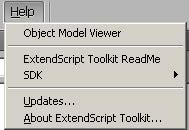
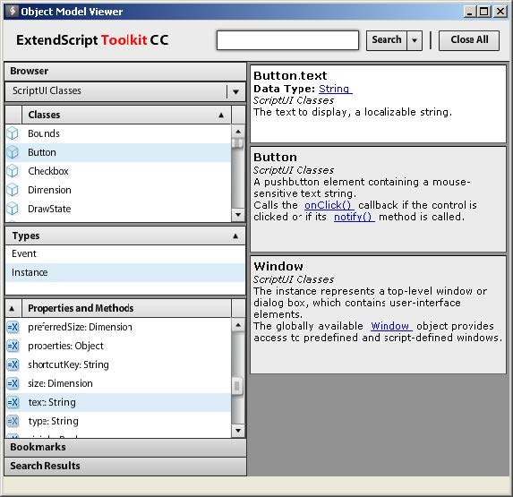
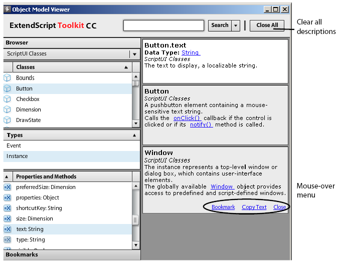

# 检查对象模型

ExtendScript Toolkit 提供了检查任何已加载字典对象模型的能力，使用从帮助菜单中调用的对象模型查看器。

对象模型查看器（OMV）作为一个独立的浮动窗口出现。OMV 允许您浏览对象层次结构，并检查每个属性的类型和描述，以及每个方法的描述和参数。

左上角浏览器部分的下拉菜单允许您从任何已加载的对象字典中进行选择。字典提供了对一个应用程序或子系统的对象模型的访问。

- **Core JavaScript Classes** 字典包括 Adobe 工具和实用程序，如文件和文件夹。
- **ScriptUI Classes** 字典显示了在 ScriptUI JavaScript 模块中定义的界面元素。
- 每个 Adobe 应用程序都定义了一个字典，用于该应用程序的文档对象模型（DOM）。特定应用程序的字典可能在该应用程序启动之前不可用，或者在 Toolkit 中将其选为目标之前不可用。

要检查对象模型，请从浏览器菜单中选择适当的字典。该模型中定义的类将出现在类面板中。选择一个类以填充类型面板中的可用元素类型（构造函数、类、实例、事件）。选择类型以填充属性和方法面板中的该类型元素。

每次选择一个类或元素时，其描述将显示在右侧；描述会堆叠显示，直到您关闭它们。您可以使用描述本身右下角的鼠标悬停菜单单独关闭每个描述，或者使用 OMV 窗口左上角的“全部关闭”按钮关闭所有打开的描述。

鼠标悬停菜单还允许您为元素添加书签以便快速访问，或从描述中复制文本。描述中的实时链接将带您到相关的对象和元素，您可以搜索名称或描述中的文本。
