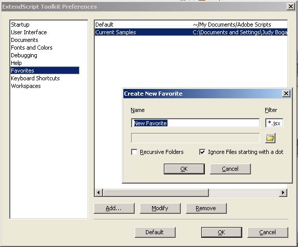

# Selecting Scripts

You can open multiple scripts (or text files, including programs in other languages). You can find and open scripts in a number of ways:

- Use File > Open to bring up the platform-specific file browser.
- Choose from recently opened files using File > Recent files.
- Create a new script using File > New JavaScript.
- Drop files from the Explorer or the Finder onto the Toolkit to open them in a document window.
- For JavaScript scripts in trusted locations (the user-script folders of installed Adobe applications), a double-click on the file runs it in the target application or in the Toolkit. For script files in other locations, you must confirm that you want to run the script.
- Search for scripts containing particular text using Edit > Find and Replace. You can search in a particular document window, among all scripts open in document windows, or among scripts associated with an application, or kept in favorite locations. See [Searching in text](the-script-editor.md#searching-in-text).
- Use the Scripts panel to display and open scripts made available by loaded Adobe applications, or those kept in favorite locations.

---

## The Scripts panel and favorite script locations

The Scripts panel offers a list of debuggable scripts, which can be JS or JSX files or (for some applications) HTML files that contain embedded scripts.

You can display a list of scripts made available by a particular target application. Select the target application in the leftmost drop-down list; the available JavaScript engines for that application become available in the right-hand list.

When you select a target application, the Toolkit offers to open that application if it is not running, then displays the scripts which that application makes public. Select a script in this panel to load it and display its contents in a new document window, where you can modify it, save it, or run it within the target application.

When you choose the target Favorites, the right-hand list shows the default favorite script location, and any other favorite locations that have been defined. You can create your own list of favorite script locations using the flyout menu.

The favorite script locations that you define are also available to the Find and Replace dialog; see [Searching in text](the-script-editor.md#searching-in-text).

You can also examine and set favorite locations using the Favorites page of the Preferences dialog (Edit > Preferences). Use the Add, Modify, and Remove buttons to edit the list of folders.

### Adobe Scripts folder

On first launch, the Toolkit creates a folder named Adobe Scripts in the user's Documents folder. The Default favorite in the Scripts panel displays the contents of this folder.

When double-clicking a JSX file, the Toolkit normally acts as an invisible security filter. Before actually launching the file, a security dialog asks if it is OK to execute the script. The Toolkit treats the user's Documents/Adobe Scripts folder, however, as a trusted location; when you double-click a JSX file in that folder, the Toolkit does not display the security alert.
