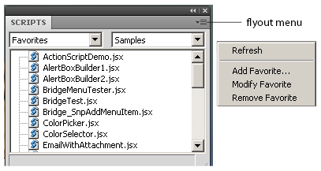

# 选择脚本

你可以打开多个脚本（或文本文件，包括其他语言的程序）。你可以通过多种方式查找并打开脚本：

- 使用 **文件 > 打开** 调出平台特定的文件浏览器。
- 使用 **文件 > 最近打开的文件** 从最近打开的文件中选择。
- 使用 **文件 > 新建 JavaScript** 创建一个新脚本。
- 从资源管理器或 Finder 中将文件拖放到 Toolkit 中，以在文档窗口中打开它们。
- 对于位于受信任位置（已安装的 Adobe 应用程序的用户脚本文件夹）中的 JavaScript 脚本，双击文件会在目标应用程序或 Toolkit 中运行它。对于其他位置的脚本文件，你必须确认是否要运行该脚本。
- 使用 **编辑 > 查找和替换** 搜索包含特定文本的脚本。你可以在特定文档窗口中搜索，或在所有打开的文档窗口中搜索，或在与应用程序关联的脚本中搜索，或在收藏的位置中搜索。请参阅 [在文本中搜索](../the-script-editor#searching-in-text)。
- 使用 **脚本面板** 显示并打开由加载的 Adobe 应用程序提供的脚本，或保存在收藏位置中的脚本。

---

## 脚本面板和收藏的脚本位置

脚本面板提供了一个可调试脚本的列表，这些脚本可以是 JS 或 JSX 文件，或者（对于某些应用程序）包含嵌入脚本的 HTML 文件。

你可以显示由特定目标应用程序提供的脚本列表。在最左侧的下拉列表中选择目标应用程序；该应用程序可用的 JavaScript 引擎将显示在右侧列表中。

当你选择目标应用程序时，如果该应用程序未运行，Toolkit 会提示打开该应用程序，然后显示该应用程序公开的脚本。在此面板中选择一个脚本以加载它，并在新的文档窗口中显示其内容，你可以在其中修改它、保存它或在目标应用程序中运行它。

当你选择 **收藏夹** 作为目标时，右侧列表会显示默认的收藏脚本位置，以及已定义的其他收藏位置。你可以使用弹出菜单创建自己的收藏脚本位置列表。

你定义的收藏脚本位置也可用于 **查找和替换** 对话框；请参阅 [在文本中搜索](../the-script-editor#searching-in-text)。

你还可以使用 **首选项** 对话框的 **收藏夹** 页面（**编辑 > 首选项**）检查和设置收藏位置。使用 **添加**、**修改** 和 **删除** 按钮编辑文件夹列表。

### Adobe 脚本文件夹

在首次启动时，Toolkit 会在用户的文档文件夹中创建一个名为 **Adobe Scripts** 的文件夹。脚本面板中的 **默认收藏夹** 显示此文件夹的内容。

双击 JSX 文件时，Toolkit 通常充当隐形的安全过滤器。在实际启动文件之前，会弹出一个安全对话框，询问是否可以执行该脚本。然而，Toolkit 将用户的 **文档/Adobe Scripts** 文件夹视为受信任位置；当你双击该文件夹中的 JSX 文件时，Toolkit 不会显示安全警报。