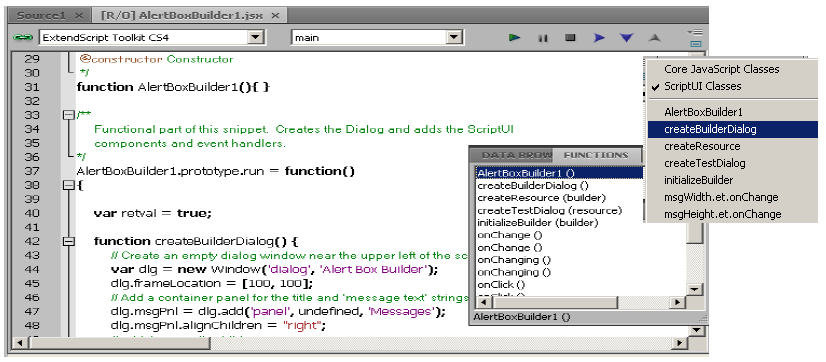
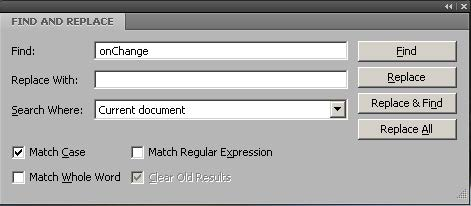

# 脚本编辑器

脚本编辑器是一个功能齐全的 JavaScript 源代码编辑器。您可以打开任意数量的脚本编辑器文档窗口；每个窗口显示一个 Unicode 源代码文档。

脚本编辑器提供了许多有用且强大的文本编辑和导航功能。其中一些功能专门用于 JavaScript，而其他功能则适用于各种文本编辑。功能包括：

- 适用于任何类型文本的导航辅助工具和选项，以及 JavaScript 的特定代码导航；请参阅 [导航辅助工具](#navigation-aids)。
- 通用编辑和编码支持，如撤销-重做，以及 JavaScript 的特定编码支持，如语法检查；请参阅 [编码辅助工具](#coding-aids)。
- 一个功能齐全的文本搜索工具，可以在多个文件中进行搜索；请参阅 [文本搜索](#searching-in-text)。
- 语法标记（针对特定语法结构的颜色和字体样式），适用于 JavaScript 和许多其他计算机语言。标记样式是可配置的；请参阅 [语法标记](#syntax-marking)。

---

## 导航辅助工具

您可以配置脚本编辑器以显示具有各种功能的文本，这些功能可以帮助您跟踪代码的结构，或者帮助您在文件中移动。它还提供了鼠标和键盘快捷键，用于特定类型的光标移动和文本选择。

### 视图选项

脚本编辑器提供了许多有助于代码导航的视图选项，包括以下内容：

- 自动行号。视图 > 行号切换行号的显示和隐藏。
- 可折叠的代码树视图，您可以打开或关闭结构的逻辑单元，如注释或函数定义。视图 > 代码折叠切换树视图的显示和隐藏。
- 换行模式，其中没有水平滚动条，并且在单词断点处换行。视图 > 自动换行切换换行模式的显示和隐藏。
- 语法标记，使用颜色和字体样式来突出显示特定的语法结构。视图 > 语法高亮允许您关闭语法标记，或将其设置为标记特定语言，如 JavaScript 或许多其他计算机语言。标记样式是可配置的；请参阅 [语法标记](#syntax-marking)。

您可以使用首选项对话框的文档页面（编辑 > 首选项）设置这些状态的默认值。

### 函数查找器

函数面板和文档窗口右上角的弹出菜单都提供了当前文档中定义的函数列表。当您在任一列表中选择一个函数时，文档会直接跳转到代码中的该函数定义。



### 书签

编辑 > 书签菜单允许您在文本中设置和清除导航点。F2 功能键是书签命令的默认快捷键：

- 使用 CTRL-F2 切换当前行的书签。
- 使用 F2 将光标移动到下一个书签，或使用 SHIFT-F2 移动到上一个书签。书签是循环的，因此第一个书签跟随最后一个书签。
- 使用 SHIFT-CTRL-F2 清除当前文本中的所有书签。

当您导航到代码折叠部分中的书签时，该部分会自动打开。

书签在行的左侧（如果显示行号，则在行号的右侧）用蓝色右箭头标记。这与断点用点标记的位置相同（请参阅 [设置断点](debugging-in-the-toolkit.md#setting-breakpoints)）。如果同一行中同时设置了断点和书签，蓝色箭头会叠加在断点点上。


### 鼠标导航和选择

您可以使用鼠标或特殊的键盘快捷键来移动插入点或在文档窗口中选择文本。在文档窗口中单击鼠标左键以移动插入点。

要使用鼠标选择文本，请在未选中的文本中单击，然后拖动以选择文本。如果您在当前显示的文本上方或下方拖动，文本会滚动，继续选择滚动的内容。您还可以双击以选择一个单词，或三击以选择一行。

要启动选定文本的拖放操作，请在选定的文本块中单击，然后拖动到目标位置。您可以将文本从一个文档窗口拖动到另一个文档窗口。您还可以将文本从工具箱拖动到接受拖动文本的其他应用程序中，并将文本从其他应用程序拖动到工具箱文档窗口中。

您可以将文件从资源管理器或 Finder 拖放到工具箱中以在文档窗口中打开它们。

### 键盘导航和选择

首选项对话框中的键盘快捷键页面（编辑 > 首选项）允许您设置或修改所有菜单命令的键盘快捷键。

除了为菜单命令指定的键盘快捷键和通常的键盘输入外，文档窗口还接受这些特殊的移动键。您还可以通过按住 `SHIFT` 键并使用移动键来选择文本。

|       快捷键       |                           行为                           |
| ------------------ | ------------------------------------------------------- |
| `ENTER`            | 插入一个换行符                                           |
| `Backspace`        | 删除左侧字符                                             |
| `DELETE`           | 删除右侧字符                                             |
| `左箭头`           | 将插入点向左移动一个字符                                 |
| `右箭头`           | 将插入点向右移动一个字符                                 |
| `上箭头`           | 将插入点向上移动一行；尽可能保持在列中                   |
| `下箭头`           | 将插入点向下移动一行；尽可能保持在列中                   |
| `Page up`          | 将插入点向上移动一页                                     |
| `Page down`        | 将插入点向下移动一页                                     |
| `CTRL + 上箭头`    | 向上滚动一行而不移动插入点                               |
| `CTRL + 下箭头`    | 向下滚动一行而不移动插入点                               |
| `CTRL + Page up`   | 向上滚动一页而不移动插入点                               |
| `CTRL + Page down` | 向下滚动一页而不移动插入点                               |
| `CTRL + 左箭头`    | 将插入点向左移动一个单词                                 |
| `CTRL + 右箭头`    | 将插入点向右移动一个单词                                 |
| `HOME`             | 将插入点移动到行首                                       |
| `END`              | 将插入点移动到行尾                                       |
| `CTRL + HOME`      | 将插入点移动到文本开头                                   |

脚本编辑器支持通过 IME（Windows）或 TMS（Mac OS）进行扩展键盘输入。这对于远东字符尤其重要。

---

## 编码辅助工具

脚本编辑器提供了许多视觉和编辑功能，帮助您在 JavaScript 代码中导航并维护其语法结构，包括以下内容。

### 代码补全

当您在文档中定位光标并开始输入时，工具箱会从关键字、全局函数、当前文档中定义的函数以及当前从弹出菜单中选择的对象模型字典中定义的函数中提供补全选项。


您可以使用文档窗口右上角的弹出菜单选择用于补全的对象模型字典。可用的字典取决于加载的应用程序。请参阅 [检查对象模型](../inspecting-object-models)。


### 括号匹配

编辑菜单提供了两种括号匹配选择，当光标紧接在左括号字符之后或紧接在右括号之前时，这些选择会起作用：

- **编辑 > 选择到括号**：将光标移动到匹配的括号，但不选择任何文本。默认的键盘快捷键是 `CTRL 0`（零）。
- **编辑 > 选择包括括号**：选择括号之间的所有文本。默认的键盘快捷键是 `SHIFT CTRL 0`（零）。

括号字符包括圆括号、花括号和方括号。

### 块缩进

当自动换行关闭时，您可以自动缩进或取消缩进整个文本块。要缩进文本块，请选择一行或多行中的部分或全部文本，然后按 TAB 键。（请注意；如果自动换行打开，这将删除选定的文本。）要取消缩进，请按 `SHIFT TAB`。

### 注释和取消注释命令

使用 **编辑 > 注释或取消注释选择** 临时从 JavaScript 程序的执行路径中删除部分内容。此命令是一个切换命令。当您首次发出该命令时，它会在任何完全或部分选中的行前面放置特殊的注释序列 //~。当您下次发出该命令并选中此类行时，它会删除该注释标记。

该命令仅影响它放置在文本中的注释标记；它会忽略已存在于选中行中的任何注释标记。这使您可以临时删除和替换包含代码和注释的文本块。

### 版本注释

一种特殊的注释格式保留用于代码版本声明，该声明由 Adobe 脚本内部使用，但可供所有脚本编写者使用。使用编辑 > 插入版本标签插入包含文件名和当前日期时间的注释，格式如下：

```javascript
/**
 * @@@BUILDINFO@@@ SnpCreateDialog.jsx !Version! Tue Dec 05 2006 08:03:38 GMT-0800
 */
```

您需要手动更新 !Version! 部分以包含您自己的版本信息。

### 撤销和重做

从 **编辑** 菜单或文档窗口的右键上下文菜单中选择 **撤销** 或 **重做**，以依次撤销和恢复多个编辑更改。更改历史记录从文件创建或加载时开始保存，并在文件保存操作中维护。

### 语法检查

在运行新脚本或将文本保存为脚本文件之前，使用 **编辑 > 检查语法** 检查文本是否包含 JavaScript 语法错误。默认的键盘快捷键是 `F7`。

- 如果脚本语法正确，状态栏显示“无语法错误。”
- 如果工具箱发现语法错误，例如缺少引号，它会突出显示受影响的文本，播放声音，并在状态栏中显示错误消息，以便您可以修复错误。

### 多行语句

脚本编辑器支持三引号语法，允许字符串跨多个源代码行。在输入非常长的字符串时，您可以：

- 在一行中输入所有内容：
    ```javascript
    var myString = "这个非常长的字符串可能会在视觉上换行到第二行，但您在输入时没有输入换行符。"
    ```
- 在多行中输入，使用反斜杠 () 作为每行的续行符：
    ```javascript
    var myString = "这个字符串跨 \
    两行。"
    ```
- 使用三引号将整个字符串括在多行中：
    ```javascript
    var myString = """这个 "引号" 词在
    由三引号括起来的多行字符串中。"""
    ```

三引号选项允许字符串包含嵌入的引号。

---

## 文本搜索

工具箱通过编辑 > 查找和替换命令提供了一个搜索实用程序。此命令会调出查找和替换面板。如果面板未停靠，您可以通过按 ESC 键隐藏它。

查找和替换面板允许您搜索多个文档以查找与特定搜索字符串或正则表达式匹配的文本。您可以选择在以下位置进行搜索：

- 当前文档，或当前文档中的当前选择
- 所有打开的文档
- 当前目标应用程序公开的所有脚本
- 您定义为收藏位置的文件夹；请参阅 [脚本面板和收藏脚本位置](selecting-scripts.md#the-scripts-panel-and-favorite-script-locations)。



搜索结果列在查找结果选项卡中；默认情况下，它与查找和替换面板堆叠在一起，但您可以将其拖动到另一个堆栈中，或显示为独立的浮动面板。


双击查找结果面板中的结果行以直接跳转到找到文本的文档和行。

### 使用正则表达式语法

工具箱支持查找和替换对话框中的有限正则表达式语法：

| 正则表达式标记 |                                                                            行为                                                                            |
| ------------- | ---------------------------------------------------------------------------------------------------------------------------------------------------------- |
| `.`           | 匹配任何字符                                                                                                                                               |
| `(`           | 标记捕获匹配区域的开始。                                                                                                                                    |
| `)`           | 标记捕获区域的结束。                                                                                                                                       |
| `\<`          | 使用编辑器当前定义的单词匹配单词的开头。                                                                                                                    |
| `\>`          | 使用编辑器当前定义的单词匹配单词的结尾。                                                                                                                    |
| `\x`          | 转义字符 x，否则该字符具有特殊含义。例如，`[` 被解释为左括号，而不是字符集的开始。                                                                          |
| `[...]`       | 一组字符；例如，[abc] 表示字符 a、b 或 c 中的任何一个。您还可以使用范围，例如 [a-z] 表示任何小写字符。                                                     |
| `[^...]`      | 集合中字符的补集。例如，[^A-Za-z] 表示除字母字符外的任何字符。                                                                                              |
| `^`           | 匹配行的开头（除非在集合中使用）。                                                                                                                          |
| `$`           | 匹配行的结尾。                                                                                                                                             |
| `*`           | 匹配 0 次或多次。例如，Sa\*m 匹配 Sm、Sam、Saam、Saaam 等。                                                                                                |

在替换操作中，您可以使用占位符 `\1` 到 `\9` 在替换表达式中使用匹配的捕获区域，其中 `\1` 引用第一个捕获区域，`\2` 引用第二个捕获区域，依此类推。

例如，如果搜索字符串是 `Fred\([1-9]\)XXX`，替换字符串是 `Sam\1YYY`，当应用于 `Fred2XXX` 时，搜索会生成 `Sam2YYY`。

## 语法标记

脚本编辑器提供基于语言的语法高亮，以帮助编辑代码。尽管调试功能（包括语法检查）仅适用于 JavaScript，但您可以选择编辑其他类型的代码，并且语法会根据语言进行高亮显示。语法标记的样式会自动设置为匹配文件扩展名，或者您可以从视图 > 语法 **高亮** 菜单中选择语言。

语法高亮的样式是可配置的，使用首选项对话框的字体和颜色页面。

