# 自动布局

当脚本创建一个窗口及其相关的用户界面元素时，它可以显式控制每个元素及其容器元素的大小和位置，或者可以利用 ScriptUI 提供的自动布局功能。自动布局机制使用有关用户界面元素的某些可用信息，以及一组布局规则，来自动确定对话框中控件的视觉上令人愉悦的布局，自动确定元素和容器的适当大小。

自动布局比显式布局更容易编程。它使脚本更易于修改和维护，并且更易于本地化为不同的语言。它还使脚本自动适应主机应用程序为 ScriptUI 窗口使用的默认字体和字体大小。

脚本程序员对自动布局过程有相当大的控制权。每个容器都有一个关联的布局管理器对象，在 `layout` 属性中指定。布局管理器控制包含元素的大小和位置，并且还调整容器本身的大小。有一个默认的布局管理器对象，或者您可以创建一个新的布局管理器：

```javascript
myWin.layout = new AutoLayoutManager( myWin );
```

---

## 默认布局行为

默认情况下，`autoLayoutManager` 对象实现了默认的布局行为。脚本可以修改默认布局管理器对象的属性，或者如果需要更专业的布局行为，可以创建一个新的自定义布局管理器。请参阅 [自定义布局管理器示例](#custom-layout-manager-example)。

容器的子元素可以组织成单行或单列，或者堆叠在一起，其中元素在容器的同一区域重叠，只有最上面的元素完全可见。这由容器的 `orientation` 属性控制，该属性可以具有值 `row`、`column` 或 `stack`。

您可以嵌套 `Panel` 和 `Group` 容器以创建更复杂的组织。例如，要显示两列控件，您可以创建一个具有行方向的 `Panel`，其中包含两个具有列方向的 `Group`。

容器具有控制元素之间的间距和边缘内边距的属性。如果未设置这些属性，布局管理器将提供默认值。

容器中子元素的对齐方式由容器的 `alignChildren` 属性和各个控件的 `alignment` 属性控制。`alignChildren` 属性确定容器的整体策略，可以被特定子元素的 `alignment` 值覆盖。

布局管理器可以通过元素的 `preferredSize` 属性确定子元素的最佳大小。该值默认为由 ScriptUI 根据控件类型的特征和可变特征（如显示的文本字符串以及用于显示文本的字体和大小）确定的尺寸。`preferredSize` 值中宽度或高度为 -1 时，布局管理器将计算该维度，同时使用指定的另一个值。

有关如何设置这些属性值以影响自动布局的详细信息，请参阅 [自动布局属性](#automatic-layout-properties)。

:::note
默认字体和字体大小在不同的平台上以及同一平台上的不同应用程序中有所不同，因此以相同方式创建的 ScriptUI 窗口在不同的上下文中可能会显示不同。
:::

---

## 自动布局属性

您的脚本通过设置容器对象和子元素中的某些属性的值来为布局管理器建立规则。以下示例显示了这些属性的各种组合值的效果。这些示例基于一个包含 `StaticText`、`Button` 和 `EditText` 元素的简单窗口，使用资源规范创建如下：

```javascript
var w = new Window( "window { \
    orientation: 'row', \
    st: StaticText { }, \
    pb: Button { text: 'OK' }, \

    et: EditText { characters:4, justify:'right' } \
}");

w.show();
```

每个示例显示了以各种方式设置特定布局属性的效果。在每个窗口中，`w.text` 被设置，以便窗口标题显示正在变化的属性，`w.st.text` 被设置以显示正在演示的特定属性值。

---

### 容器方向

容器的 `orientation` 属性指定其子元素的组织方式。它可以具有以下值：

|  值      |                                                                                                                                                                                  行为                                                                                                                                                                                  |
| -------- | -------------------------------------------------------------------------------------------------------------------------------------------------------------------------------------------------------------------------------------------------------------------------------------------------------------------------------------------------------------------------- |
| `row`    | 子元素排列在容器中的单行中，从左到右排列。容器的高度基于行中最高的子元素的高度，容器的宽度基于所有子元素的宽度之和。                                                                             |
| `column` | 子元素排列在容器中的单列中，从上到下排列。容器的高度基于所有子元素的高度之和，容器的宽度基于列中最宽的子元素的宽度。                                                                             |
| `stack`  | 子元素重叠排列，就像一叠纸一样。元素在容器的同一区域中重叠。只有最上面的元素完全可见。容器的高度基于堆栈中最高的子元素的高度，容器的宽度基于堆栈中最宽的子元素的宽度。 |

下图显示了使用这些方向布局示例窗口的结果：

  
  
  

---

### 对齐子元素

容器中子元素的对齐方式由两个属性控制：父容器中的 `alignChildren` 和每个子元素中的 `alignment`。父容器中的 `alignChildren` 值控制该容器内所有子元素的对齐方式，除非被子元素的 `alignment` 值覆盖。

这些属性使用相同的值，这些值根据容器的方向指定沿一个轴的对齐方式。您可以指定两个字符串的数组，以指定沿两个轴的对齐方式。第一个字符串指定水平值，第二个字符串指定垂直值。属性值不区分大小写；例如，字符串 `FILL`、`Fill` 和 `fill` 都是有效的。

您还可以使用 ScriptUI 类的 `Alignment` 属性中的相应常量设置值；例如：

```javascript
myGroup.alignment = [ ScriptUI.Alignment.LEFT, ScriptUI.Alignment.TOP]
```

如果您使用常量设置 `alignment` 值，然后查询该属性，它将返回与常量对应的索引号，而不是字符串值。

行中的元素可以沿垂直轴对齐，方式如下：

|  值      |                                                 行为                                                 |
| -------- | -------------------------------------------------------------------------------------------------------- |
| `top`    | 元素的顶部边缘位于其容器的顶部边距处。                                    |
| `bottom` | 元素的底部边缘位于其容器的底部边距处。                              |
| `center` | 元素在其容器的顶部和底部边距之间居中。                              |
| `fill`   | 元素的高度调整为填充容器在顶部和底部边距之间的高度。 |

列中的元素可以沿水平轴对齐，方式如下：

|  值      |                                                行为                                                |
| -------- | ------------------------------------------------------------------------------------------------------ |
| `left`   | 元素的左边缘位于其容器的左边距处。                                |
| `right`  | 元素的右边缘位于其容器的右边距处。                              |
| `center` | 元素在其容器的右边和左边距之间居中。                            |
| `fill`   | 元素的宽度调整为填充容器在右边和左边距之间的宽度。 |

堆栈中的元素可以沿垂直或水平轴对齐，方式如下：

|  值      |                                                                                                       行为                                                                                                       |
| -------- | -------------------------------------------------------------------------------------------------------------------------------------------------------------------------------------------------------------------- |
| `top`    | 元素的顶部边缘位于其容器的顶部边距处，并且元素在其容器的右边和左边距之间居中。                                                                |
| `bottom` | 元素的底部边缘位于其容器的底部边距处，并且元素在其容器的右边和左边距之间居中。                                                          |
| `left`   | 元素的左边缘位于其容器的左边距处，并且元素在其容器的顶部和底部边距之间居中。                                                              |
| `right`  | 元素的右边缘位于其容器的右边距处，并且元素在其容器的顶部和底部边距之间居中。-                                                           |
| `center` | 元素在其容器的顶部、底部、右边和左边距之间居中。                                                                                                                             |
| `fill`   | 元素的高度调整为填充容器在顶部和底部边距之间的高度，并且元素的宽度调整为填充容器在右边和左边距之间的宽度。 |

下图显示了创建具有行方向的示例窗口并在父容器的 `alignChildren` 属性中设置 `bottom` 和 `top` 对齐设置的结果：

  
  

下图显示了创建具有列方向的示例窗口并在父容器的 `alignChildren` 属性中设置 `right`、`left` 和 `fill` 对齐设置的结果。请注意在 `fill` 情况下，每个元素的宽度都调整为容器中最宽元素的宽度：

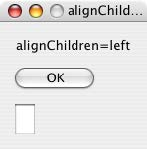  
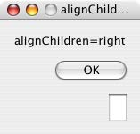  
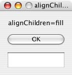  

您可以通过设置特定子元素的 `alignment` 属性来覆盖容器的子元素对齐方式（由 `alignChildren` 指定）。下图显示了当父容器的 `alignChildren` 值为 `left` 时，将 `EditText` 元素的 `alignment` 设置为 `right` 的结果：

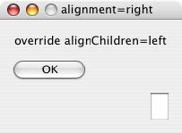  

---

### 二维对齐

您可以使用两个字符串的数组而不是单个字符串来设置 `alignment` 属性，其中第一个字符串是水平对齐，第二个字符串是垂直对齐。这允许您控制具有行方向的容器中子元素的水平放置，以及具有列方向的容器中子元素的垂直放置。

下图显示了示例脚本 [SnpAlignElements.jsx](https://github.com/Adobe-CEP/CEP-Resources/blob/master/ExtendScript-Toolkit/Samples/javascript/SnpAlignElements.jsx) 的结果，该脚本演示了如何指定二维对齐。

- 在第一个图中，每个控件在其行中垂直居中，并使用诸如 `["left", "center"]` 的对齐值将每个元素放置在特定的水平位置：
    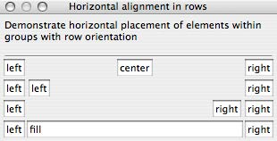  
- 垂直对齐示例创建了四列，并将控件沿垂直轴放置在每列中。它使用诸如 `["fill", "top"]` 的对齐值在列中分布控件，同时仍然控制相对垂直位置：
    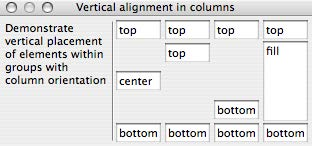  

---

### 设置边距

容器的 `margins` 属性指定容器边缘与子元素最外层边缘之间的像素数。您可以将此属性设置为一个简单的数字以指定相等的边距，或者使用 `Margins` 对象，该对象允许您为容器的每个边缘指定不同的边距。

下图显示了创建具有行方向和 5 和 15 像素边距的示例窗口的结果：

  
  

此图显示了创建具有列方向、顶部边距为 0 像素、底部边距为 20 像素以及左右边距为 15 像素的示例窗口的结果：

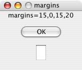  

---

### 子元素之间的间距

容器的 `spacing` 属性指定一个子元素与其相邻兄弟元素之间的像素数。

此图显示了创建具有行方向和 15 和 5 像素间距的示例窗口的结果：

  
  

此图显示了创建具有列方向和 20 像素间距的示例窗口的结果：

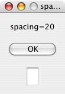  

---

### 确定首选大小

每个元素都有一个 `preferredSize` 属性，该属性最初定义为元素的合理默认尺寸。默认值由 ScriptUI 计算，基于每种元素类型的常量特征以及可变特征（如要在按钮或文本元素中显示的文本字符串）。

如果未定义元素的 `size` 属性，布局管理器将使用 `preferredSize` 的值来确定布局过程中每个元素的尺寸。通常，您应避免显式设置 `preferredSize` 属性，而是让 ScriptUI 根据布局时元素的状态确定最佳值。这允许您使用可本地化的字符串设置用户界面元素的文本属性（请参阅 [ScriptUI 对象中的本地化](../localization-in-scriptui-objects)）。每个元素的宽度和高度在布局时根据所选的语言特定文本字符串计算，而不是依赖脚本为每个元素指定固定大小。

但是，脚本可以显式设置 `preferredSize` 属性，以向布局管理器提示某些元素的预期大小，这些元素的合理默认大小不容易确定，例如没有初始图像可测量的 `IconButton` 元素。

您可以使用 `preferredSize` 仅设置一个维度；宽度或高度为 -1 的值会导致布局管理器计算该维度，同时使用提供的另一个值。

您还可以为控件设置最大和/或最小大小值，以限制其调整大小的方式。有一个默认的最大大小，可防止自动布局创建大于屏幕的元素。

您可以使用布局对象的 [resize()](../layoutmanager-object#resize) 方法显式调整窗口中的控件大小以适应当前文本内容，或在用户调整窗口大小后进行调整。

---

### 创建更复杂的排列

您可以通过在 `Panel` 容器和其他 `Group` 容器中嵌套 `Group` 容器来轻松创建更复杂的排列。

许多对话框由要填写的行信息组成，其中每行都有相关类型的控件列。例如，编辑字段通常位于静态文本标签旁边的一行中，该标签标识它，并且一系列这样的行排列在一列中。此示例（使用 [资源规范](../resource-specifications) 创建）显示了一个简单的对话框，用户可以在其中输入两个 `EditText` 字段的信息，每个字段与其 `StaticText` 标签排列在一行中。为了创建布局，具有列方向的 `Panel` 包含两个具有行方向的 `Group` 元素。这些组包含控件行。第三个 `Group` 位于面板外部，包含按钮行。

```javascript
var res = "dialog { \
    info: Panel { orientation: 'column', \
        text: 'Personal Info', \
        name: Group { orientation: 'row', \
            s: StaticText { text:'Name:' }, \
            e: EditText { characters: 30 } \
        }, \
        addr: Group { orientation: 'row', \
            s: StaticText { text:'Street / City:' }, \
            e: EditText { characters: 30 } \
        } \
    }, \
    buttons: Group { orientation: 'row', \
        okBtn: Button { text:'OK', properties:{name:'ok'} }, \
        cancelBtn: Button { text:'Cancel', properties:{name:'cancel'} } \
    } \
}";
win = new Window( res );
win.center();
win.show();
```

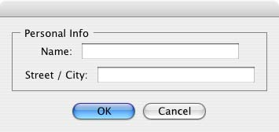  

在这个最简单的示例中，列没有垂直对齐。当您在行中使用固定宽度的控件时，一种简单的方法是将 `StaticText` 标签对齐到面板的右侧。在示例中，将以下内容添加到 `Panel` 规范中：

```javascript
info: Panel { orientation: 'column', alignChildren:'right', \
```

这将创建以下结果：

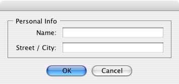  

假设现在您需要两个面板，并且希望每个面板在对话框中具有相同的宽度。您可以在对话框窗口对象级别指定这一点，即两个面板的父级。指定 `alignChildren="fill"`，这会使对话框的每个子元素匹配其宽度到最宽的子元素。

```javascript
var res = "dialog { alignChildren: 'fill', \
    info: Panel { orientation: 'column', alignChildren:'right', \
        text: 'Personal Info', \
        name: Group { orientation: 'row', \
            s: StaticText { text:'Name:' }, \
            e: EditText { characters: 30 } \
        } \
    }, \
    workInfo: Panel { orientation: 'column', \
        text: 'Work Info', \
        name: Group { orientation: 'row', \
            s: StaticText { text:'Company name:' }, \
            e: EditText { characters: 30 } \
        } \
    }, \
    buttons: Group { orientation: 'row', alignment: 'right', \
        okBtn: Button { text:'OK', properties:{name:'ok'} }, \
        cancelBtn: Button { text:'Cancel', properties:{name:'cancel'} } \
    } \
}";
win = new Window( res );
win.center();
win.show();
```

  

为了使按钮出现在对话框的右侧，`buttons` 组覆盖了其父级（对话框）的 `fill` 对齐方式，并指定 `alignment="right"`。

---

### 创建动态内容

许多对话框需要根据用户在对话框中选择某些选项来呈现不同的信息集。您可以使用堆栈方向在同一对话框区域中呈现不同的视图。

容器的 `stack` 方向将子元素放置在容器的同一区域中，以便它们居中在一个足够宽以容纳最宽子元素和足够高以容纳最高子元素的空间中。如果您在这样的堆栈中排列组或面板，您可以显示和隐藏它们以在同一空间中显示不同的控件集，具体取决于对话框中的其他选择。

例如，此对话框根据用户在 `DropDownList` 中的选择动态更改。

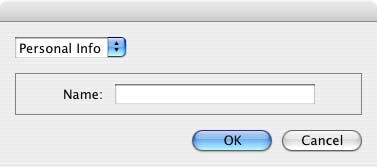  
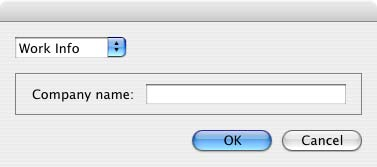  

以下脚本创建此对话框。它将前面示例中的“Personal Info”和“Work Info”面板压缩为一个具有两个 `Group` 的 `Panel`，这些 `Group` 排列在堆栈中。`DropDownList` 允许用户选择要查看的信息集。当用户在列表中进行选择时，其 `onChange` 函数显示一个组并隐藏另一个组。

```javascript
var res =