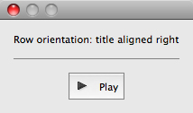
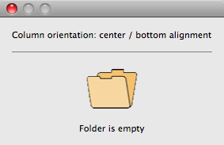
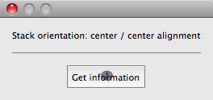
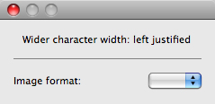
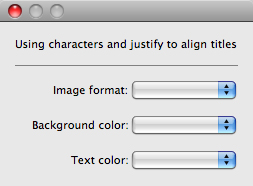
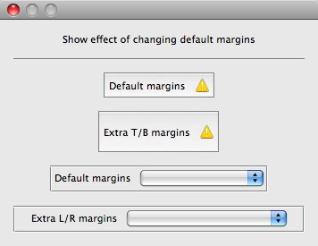

# 管理控件标题

用户界面元素通常需要一个标题或标签来标识其用途，标题通常放置在它所标识的元素附近。如[自动布局](../automatic-layout)中的示例所示，您可以使用`statictext`元素作为标题或标签，并使用自动布局机制来控制此类标题相对于它所标识的元素的位置。

标题布局机制为许多常见情况提供了一种更简单的方式来完成此任务。它允许您定义元素的标题及其与所标识对象的图形表示之间的空间关系，而无需额外的`statictext`和容器元素。标题布局操作依赖于元素的可选[title](../control-objects#title)和[titleLayout](../control-objects#titlelayout)属性。

它将此标题和元素的图形表示视为两个独立的对象，这两个对象的相对位置由包含它们的虚拟容器内的布局规则控制。这与自动布局机制的操作类似，但范围更有限。

标题布局适用于以下类型的UI元素：

- [DropDownList](../control-objects#dropdownlist)
- [FlashPlayer](../control-objects#flashplayer)
- [IconButton](../types-of-controls#iconbutton)
- [Image](../types-of-controls#image)
- [TabbedPanel](../control-objects#tabbedpanel)

对于大多数这些元素类型，标题通常出现在元素本身之外，虚拟容器是围绕标题和独立元素的假想线。对于IconButton，标题出现在按钮的边界内，虚拟容器由元素的外部边界定义。两种情况下的原理相同。

- [title](../control-objects#title)属性是一个字符串，用于定义UI元素的文本标签。标题可以出现在图形元素的左侧或右侧、上方或下方，或者叠加在图形元素的中心；其位置由[titleLayout](../control-objects#titlelayout)属性控制。
- [titleLayout](../control-objects#titlelayout)属性是一个对象，包含以下属性：
    - 标题的字符宽度；
    - 标题在字符宽度内的对齐方式；
    - 标题在必要时应如何截断；
    - 标题相对于所标识对象的朝向、对齐方式和间距；
    - 围绕标题及其相关对象的虚拟容器内的边距。

所有`titleLayout`属性都是可选的；使用此机制的元素类型为每个属性提供了默认值。完整的详细信息请参阅参考部分；参见[titleLayout](../control-objects#titlelayout)。

以下部分提供了示例，展示了如何使用标题布局来实现许多不同的布局。

---

## 标题对齐和朝向

与自动布局不同，标题布局使用[alignment](../control-objects#alignment)属性来指定标题和图形元素的朝向，以及标题如何与图形元素对齐。此属性包含一个2元素数组，其中第一个元素指定水平对齐，第二个元素指定垂直对齐。这些允许的值与自动布局使用的值相同（参见[对齐子元素](../automatic-layout#aligning-children)），但不允许使用`fill`值。

- 要实现标题出现在图形元素左侧或右侧的行朝向，将水平对齐定义为`left`或`right`，垂直对齐定义为`center`、`top`或`bottom`：
    ```javascript
    button.titleLayout = { alignment: ["right", "center"] };
    ```

    
- 要实现标题出现在图形元素上方或下方的列朝向，将垂直对齐定义为`top`或`bottom`，水平对齐定义为`center`：
    ```javascript
    image.titleLayout = { alignment: ["center", "bottom"] };
    ```

    
- 要实现标题叠加在图形元素上的堆叠朝向，将垂直和水平对齐都定义为`center`。这种朝向主要用于`iconbutton`或`image`元素类型；例如，将标题叠加在dropdownlist上就没有意义。在此示例中，按钮的标题居中在其图标图像上：
    ```javascript
    button.title = "获取信息";
    button.titleLayout = { alignment: ["center", "center"] };
    ```

    
- 在行朝向下，您可以控制标题是与图形元素的顶部、中心还是底部对齐。在此示例中，标题放置在图像的左侧，与顶部边缘对齐：
    ```javascript
    image.titleLayout = { alignment: ["left", "top"] };
    ```

    
- 使用`spacing`覆盖标题与图形元素之间的默认像素间距。在此示例中，`titleLayout`配置为将标题放置在面板上方15像素处：
    ```javascript
    panel.title = "图像格式";
    panel.titleLayout = { alignment: ["center", "top"], spacing: 15 };
    ```

    

---

## 标题字符宽度和对齐

- 要覆盖自动计算的标题宽度，为`characters`属性定义一个正的非零值。这将为标题区域保留足够的空间以容纳指定数量的“X”字符。当元素的标题可能发生变化时（例如本地化值），这非常有用，您希望保留足够的空间以容纳所有预期值，而不会截断或影响整体布局。
    ```javascript
    droplist.titleLayout = { alignment: ["left", "center"], characters: 20 };
    ```

    
- 当`characters`值指定的宽度大于默认标题宽度时，您可以设置`justify`属性来控制标题文本在为其保留的空间内的对齐方式。值`left`将文本放置在空间的左端，右侧留出空白；`right`将文本放置在空间的右端，左侧留出空白；`center`将文本放置在空间的中间，将空白均匀分布在文本的两侧。
    ```javascript
    droplist.titleLayout = { alignment: ["left", "center"],
                             characters: 20,
                             justify: "right" };
    ```

    
- 此示例演示了使用`characters`和`justify`来垂直对齐一组dropdownlist控件标题末尾的冒号。每个元素的`title`使用相同的`characters`值，并且所有标题都右对齐：
    ```javascript
    w.ddl1 = w.add("dropdownlist { title: '图像格式:' }");
    w.ddl2 = w.add("dropdownlist { title: '背景颜色:' }");
    w.ddl3 = w.add("dropdownlist { title: '文本颜色:' }");
    w.ddl1.titleLayout = { alignment: ["left", "center"], spacing: 3,
                           characters: 16, justify: "right" };
    w.ddl2.titleLayout = { alignment: ["left", "center"], spacing: 3,
                           characters: 16, justify: "right" };
    w.ddl3.titleLayout = { alignment: ["left", "center"], spacing: 3,
                           characters: 16, justify: "right" };
    ```

    

---

## 标题截断

如果为标题保留的空间不足以显示其完整文本，请设置`truncate`属性以控制截断文本的外观。如果`truncate`为`middle`，则从文本中间删除字符并用省略号（...）替换。对于值`end`，从文本末尾删除字符并用省略号替换。如果`truncate`为`none`或未定义，则从末尾删除字符，而不使用任何替换的省略号字符。

此示例演示了所有三个选项对相同标题字符串的影响：

```javascript
w.btn1 = w.add("iconbutton { title: 'Start 123456 End', image: 'SystemWarningIcon' }");
w.btn2 = w.add("iconbutton { title: 'Start 123456 End', image: 'SystemWarningIcon' }");
w.btn3 = w.add("iconbutton { title: 'Start 123456 End', image: 'SystemWarningIcon' }");
w.btn1.titleLayout = { characters: 8, truncate: 'middle' };
w.btn2.titleLayout = { characters: 8, truncate: 'end' };
w.btn3.titleLayout = { characters: 8, truncate: 'none' };
```


---

## 标题和图形对象周围的边距

`margins`属性指定元素边缘与元素内可见内容之间的像素数。此值覆盖默认的边距设置（大多数元素类型没有边距，`iconbutton`的每个边缘有6像素）。

- 对于`iconbutton`，`margins`值控制按钮框架与其标题和图标图像之间的填充。
- 对于其他元素类型，`margins`控制围绕标题和图形对象的边界框联合的假想边框内的填充，这使得元素占用的空间大于其默认测量值。

此示例演示了覆盖`iconbutton`和`dropdownlist`元素的默认边距。

列表被包含在面板中以创建围绕它们的假想边框：

```javascript
w.btn1 = w.add("iconbutton { title: '默认边距', image: 'SystemWarningIcon' }");

w.btn2 = w.add("iconbutton { title: '额外的上/下边距', image: 'SystemWarningIcon' }");
var defaultBtnMargins = w.btn2.titleLayout.margins;
w.btn2.titleLayout = { margins: [defaultBtnMargins[0], 15, defaultBtnMargins[2], 15] };

w.panel1 = w.add("panel { margins: 0, ddl1: DropDownList { title: '默认边距' } }");
w.panel2 = w.add("panel { margins: 0, ddl2: DropDownList { title: '额外的左/右边距' } }");
w.panel2.ddl2.titleLayout = { margins: [15, 0, 15, 0] };
```

