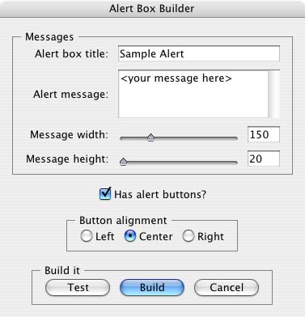

# 资源规范

你可以使用*资源*规范一次性创建一个或多个用户界面元素。这种特殊格式的字符串提供了一种简单且紧凑的方式来创建元素，包括任何容器元素及其组件元素。资源规范字符串作为 `type` 参数传递给 `Window()` 或 `add()` 构造函数。

资源规范的一般结构是一个元素类型规范（例如 `dialog`），后跟一组大括号，括号内包含一个或多个属性定义。

```javascript
var myResource = "dialog{ control_specs }";
var myDialog = new Window ( myResource );
```

控件被定义为窗口和其他容器中的属性。对于每个控件，给出控件的类名，后跟用大括号括起来的控件属性。例如，以下代码指定了一个按钮：

```javascript
testBtn: Button { text: "Test" }
```

以下资源字符串指定了一个包含分组 `StaticText` 和 `EditText` 控件的面板：

```javascript
"msgPnl: Panel { orientation:'column', alignChildren:['right', 'top'],\
   text: 'Messages', \
   title: Group { \
    st: StaticText { text:'Alert box title:' }, \
    et: EditText { text:'Sample Alert', characters:35 } \
   }
   msg: Group { \
    st: StaticText { text:'Alert message:' }, \
    et: EditText { properties:{multiline:true}, \
    text:'<your message here>' \
   } \
}"
```

名为 `properties` 的属性指定了创建 `properties`；请参阅[创建属性](../scriptui-programming-model#creation-properties)。

属性值可以指定为 `null`、`true`、`false`、字符串、数字、内联数组或对象。

- 内联数组包含一个或多个值，形式如下：

   ```javascript
   [ value, value, ... ]
   ```

- 对象可以是内联对象或命名对象，形式如下：

   ```javascript
   { classname inlineObject }
   ```

   在这种情况下，`classname` 必须是[控件类型](../types-of-controls)中列出的控件类名之一。
- 内联对象包含一个或多个属性，形式如下：

   ```javascript
   { propertyName: propertyValue, propertyName: propertyValue, ... }
   ```

---

## 使用资源字符串

[Adobe ExtendScript SDK](https://github.com/Adobe-CEP/CEP-Resources/tree/master/ExtendScript-Toolkit) 中的这些示例演示了如何使用资源规范字符串：

| [AlertBoxBuilder1.jsx](https://github.com/Adobe-CEP/CEP-Resources/blob/master/ExtendScript-Toolkit/Samples/javascript/AlertBoxBuilder1.jsx)   | 演示了一种使用资源字符串的方式，创建一个允许用户输入一些值的对话框，然后使用这些值构建可自定义的警告对话框的资源字符串。   |
|-----------------------------------------------------------------------------------------------------------------------------------------------|------------------------------------------------------------------------------------------------------------------------------------------------------------------------------------------------------------|
| [AlertBoxBuilder2.jsx](https://github.com/Adobe-CEP/CEP-Resources/blob/master/ExtendScript-Toolkit/Samples/javascript/AlertBoxBuilder2.jsx)   | 使用资源字符串（而不是 `add()` 方法）指定用户输入对话框的所有内容，构建相同的对话框。        |

这两个 Alert Box Builder 示例创建了相同的对话框来从用户那里收集值。



Build 按钮的事件处理程序根据收集的值构建资源字符串，并从对话框调用函数中返回它；然后脚本将资源字符串保存到文件中。该资源字符串稍后可用于创建并显示用户配置的警告框。

资源规范格式也可用于创建单个元素或容器及其子元素。例如，如果示例中的 `alertBuilderResource` 不包含面板 `btnPnlResource`，你可以单独定义该资源，然后将其添加到对话框中，如下所示：

```javascript
var btnPnlResource = "btnPnl: Panel { orientation:'row', \
   text: 'Build it', \
   testBtn: Button { text:'Test' }, \
   buildBtn: Button { text:'Build', properties:{name:'ok'} }, \
   cancelBtn: Button { text:'Cancel', properties:{name:'cancel'} } \
}";

dlg = new Window( alertBuilderResource );
dlg.btnPnl = dlg.add( btnPnlResource );
dlg.show();
```
