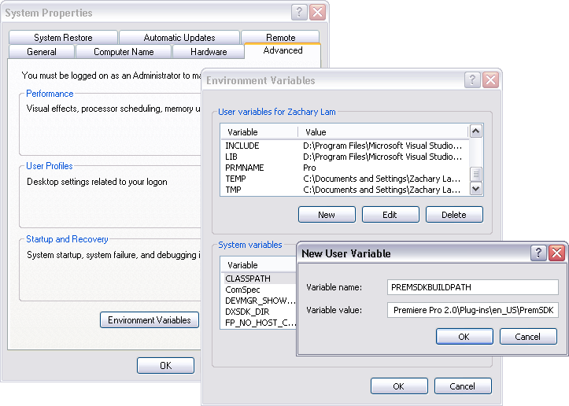

# 示例项目

## 描述

|   名称   |        描述        |
|-------------------|---------------------------------------------------------------------------------------------------------------------------------------------------------------------------------------------------------------------------------|
| SDK 文件导入器   | 该导入器支持 .sdk 媒体文件。       |
|     | 要使用导入器，请选择“文件 > 导入”，并选择一个 .sdk 文件。此类文件可以使用 SDK 导出器创建。       |
|     | 它支持带或不带 alpha 通道的未压缩 8 位 RGB，以及打包的 10 位 YUV (v410)。     |
|     | 它支持单声道、立体声和 5.1 音频，支持任意采样率和 32 位浮点。     |
|     | 它支持使用项目管理器、属性和数据速率分析进行修剪，支持 Unicode 文件名、`avoidAudioConform` 标志，并且可以异步读取视频帧。        |
|     | 它还包含一个多流音频测试工具，可以通过取消注释头文件中的 `MULTISTREAM_AUDIO_TESTING` 定义来启用。       |
| 合成导入器   | 该合成导入器生成 8 位 YUV 和 RGB，仅视频。       |
|     | 要使用它，请选择“文件 > 新建 > SDK 合成导入器”。   |
|     | 创建剪辑时，它会演示一个示例设置对话框，可以通过在项目面板或时间轴面板中双击剪辑再次显示该对话框。      |
|     | 每次显示设置对话框时，它都会在内存中创建新的素材。它创建 10 秒的素材，帧率为 24 fps。视频由随机颜色的水平线组成。    |
|     | 不会在磁盘上创建文件，有关示例，请参阅自定义导入器。   |
| SDK 自定义导入器  | 该自定义导入器创建一个类似于合成导入器示例的剪辑，但将其生成到磁盘而不是内存中。        |
|     | 要使用它，请选择“文件 > 新建 > SDK 自定义导入器”。         |
|     | 或者，从“文件 > 导入”对话框中导入现有的 .sdkc 剪辑。       |
|     | 在 Windows 上，新生成的带有 .sdkc 文件扩展名的文件将创建在 `C:\Windows\Temp` 中。在 macOS 上，它们将创建在桌面上。    |
|     | 在示例设置对话框之后，它可以选择显示时间轴中的背景帧（对标题制作很有用）。      |
|     | 生成的素材为 2 到 30 帧，帧率为 24 fps，随机分辨率为 32 到 720 像素宽，32 到 480 像素高，采用 DV NTSC 像素宽高比。    |
| 导出控制器   | 在“文件 > 导出 > SDK 导出控制器”中添加一个新菜单项。       |
|     | 选择后，它会在 Windows 上显示一个简单的消息框，采用 DV NTSC 宽屏预设，并将文件导出到 Windows 上的 `C:\Windows\Temp` 或 macOS 上的桌面。     |
| SDK 导出器   | 该导出器写入 .sdk 文件。   |
|     | 要使用它，请选择“文件 > 导出 > 媒体”，在导出设置中选择文件类型：SDK 文件。       |
|     | 它支持带或不带 alpha 通道的未压缩 8 位 RGB，以及打包的 10 位 YUV (v410)。     |
|     | 它支持单声道、立体声和 5.1 音频，支持任意采样率和 32 位浮点。     |
|     | 它演示了自定义参数，包括自定义设置按钮。      |
|     | 它还将标记数据写入具有相同文件名的 .html 文件中。      |
|     | 要使用 8 位 RGB 源写入 v410 压缩文件，此示例使用例程将 8 位 RGB 数据转换为 32 位 RGB，然后转换为 32 位 YUV，最后转换为 v410。        |
|     | 这些相同的例程可以适用于过渡、滤镜和其他插件类型。     |
| 传输插件     | 该示例传输插件不输出到任何硬件，但可用于在调试器中逐步查看主机和插件之间的交互。        |
|     | 要使用它，请转到“首选项 > 播放”，并选择 SDK 传输器作为音频设备和视频设备。     |
|     | 该传输插件提供了基本结构，分离了插件和实例的概念。对于视频，它声明支持任何像素格式和分辨率。        |
|     | 对于音频，它声明支持 2 个通道。它还声明了一个小的延迟值用于演示目的。   |
|     | 在 Windows 上，有一些基本的调试日志记录。      |
|     | 目前它实际上不提供自己的时钟，但在播放时，它只是假装每接收到一帧就向前移动一帧。        |
|     | 这可能会导致一些错误行为，例如以比正常速度快或慢的速度播放，具体取决于主机推送帧的速度。   |
| SDK_ProcAmp   | 该 GPU 加速效果演示了使用 After Effects API 和 Premiere Pro GPU 扩展的简单 ProcAmp 效果。     |
|     | 该效果可以在效果控制面板的视频效果中的 SDK 文件夹中找到。   |
|     | 它支持 Metal 加速。        |
|     | **此示例需要 macOS 10.11.4 及更高版本。**     |
| 晕影效果     | 该效果使用 After Effects API 和 Premiere Pro GPU 扩展在视频上创建晕影效果。     |
|     | 具有 CUDA 和软件渲染路径。         |
|     | Premiere Pro 中的软件渲染包括 8 位/32 位 RGB/YUV 软件渲染路径。   |
|     | After Effects 中的软件渲染包括 8 位和 32 位智能渲染。   |
|     | 感谢 Bart Walczak 捐赠此示例。      |
| SDK_交叉溶解     | 该 GPU 加速过渡演示了使用 After Effects API 和过渡扩展的简单交叉溶解过渡。      |
|     | 该过渡可以在效果控制面板的视频过渡中的 SDK 文件夹中找到。   |
|     | 它支持 CUDA 加速。        |
| 控制表面     | 您应该在 PPro UI 中的“首选项 > 控制表面”中看到该插件，当您点击“添加”按钮时，它会在设备类下拉列表中显示为选项之一，位于 Mackie 和 EUCON 旁边（当前显示为“SDK 控制表面示例”）。   |
|     | 这只是您添加功能的起点。   |

---

## 如何构建 SDK 示例项目

所需的开发环境在 [SDK 受众](../sdk-audience) 中有描述。

观看一个关于使用类似 SDK 构建效果的快速入门视频（在 macOS 上）[这里](https://assets.adobe.com/public/08c43fb7-4633-4007-5201-b3b77405d770?scid=social_20180227_75678337)。

我们将示例项目合并到一个主项目中，存储在 SDK 的 Examples 文件夹中。

对于 macOS，它是 BuildAll.xcodeproj；对于 Windows，它是 \_BuildAll.sln。

您需要指定一些设置，以便将插件构建到您正在开发的应用程序将加载的文件夹中。

我们建议将插件构建到以下文件夹中：

对于 macOS：`/Library/Application Support/Adobe/Common/Plug-ins/[version]/MediaCore/`

版本锁定为 7.0 适用于所有 CC 版本，或 CSx 适用于早期版本。

例如：`/Library/Application Support/Adobe/Common/Plug-ins/7.0/MediaCore/`

或：`/Library/Application Support/Adobe/Common/Plug-ins/CS6/MediaCore/`

对于 Windows：

`[Program Files]\Adobe\Common\Plug-ins\[version]\MediaCore\\`

例如：`C:\Program Files\Adobe\Common\Plug-ins\7.0\MediaCore\\`

或：`C:\Program Files\Adobe\Common\Plug-ins\CS6\MediaCore\\`

:::note
此 Windows 路径仅推荐用于开发目的。
:::

在 Xcode 中，设置项目的构建位置：文件 > 项目设置。点击“高级”按钮。在构建位置下选择“自定义”，选择“绝对”，并设置产品路径。

在 Visual Studio 中，为了方便起见，我们已将所有示例项目的输出文件设置为使用由环境变量 PREMSDKBUILDPATH 设置的基本路径。您需要将其设置为系统的用户环境变量，如下面的屏幕截图所示。

*设置环境变量*

1. 在 Windows 上，右键单击“我的电脑 > 属性”，在左侧边栏中选择“高级系统设置”。
2. 在出现的对话框中，点击“环境变量”按钮。
3. 在“用户变量”中，创建一个名为 PREMSDKBUILDPATH 的新变量，路径如上所述。（例如："C:\Program Files\Adobe\Common\Plug-ins\[version]\MediaCore"）。
4. 注销 Windows，然后重新登录以使变量生效。

在编译插件时，如果看到链接错误，例如：

“无法打开文件‘[MediaCore 插件路径]plugin.prm’”，请确保以管理员模式启动 Visual Studio。在您的 Visual Studio 安装中，右键单击 devenv.exe，属性 > 兼容性 > 权限级别，点击“以管理员身份运行此程序”。

不建议在构建插件后将插件复制到插件文件夹中，因为这不允许您在主机应用程序运行时调试插件。
